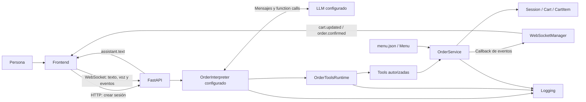
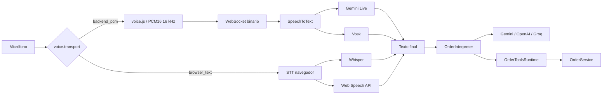

# Arquitectura y contratos actuales

## Visión general

Self-Order es una aplicación Python modular con FastAPI, un frontend HTML/CSS/JavaScript y proveedores configurables para transcripción e interpretación. La configuración utilizada para la demostración usa Web Speech API como STT y Groq como LLM. Los STT implementados son Web Speech API, Whisper en navegador, Vosk y Gemini Transcribe Live. Para la interpretación del pedido están disponibles Gemini, OpenAI y Groq.

No son microservicios: los módulos del backend comparten un proceso y las sesiones viven en memoria. La separación busca que las reglas del pedido no dependan del proveedor de IA, del mecanismo de voz ni de la interfaz. El LLM interpreta la intención; `OrderService` decide si una operación es válida y mantiene la autoridad sobre menú, precios, disponibilidad y estado del pedido.



El texto del asistente y el carrito tienen orígenes diferentes. El intérprete y el runtime construyen las respuestas conversacionales; `OrderService` construye y valida el estado del pedido. Después de una mutación, la confirmación se genera desde el carrito validado para evitar que una redacción libre del LLM contradiga el estado real.

Esta separación fue elegida porque el lenguaje natural es ambiguo y un modelo no debe poder inventar productos, precios, modificadores o transiciones de estado. Cambiar Groq por Gemini u OpenAI, o cambiar el STT, no requiere reescribir las reglas del carrito.

## Mapa de módulos y funciones

| Archivo | Responsabilidad y puntos de entrada |
| --- | --- |
| `backend/domain/product.py` | `Product`, `ModifierGroup`, `ModifierOption`: estructura del catálogo y adicionales de precio. |
| `backend/domain/menu.py` | Carga y valida el catálogo; resuelve productos y detalles visibles de modificadores. |
| `backend/domain/cart_item.py` | `CartItem`: línea de carrito con producto, cantidad, configuración y precio unitario. |
| `backend/domain/cart.py` | `Cart` y cálculo del total. |
| `backend/domain/session.py` | `Session`, identificador, carrito y estados `ACTIVE`, `PAYMENT_PENDING` y `CONFIRMED`. |
| `backend/services/order_service.py` | Autoridad transaccional: valida y modifica el pedido y controla el flujo de pago. |
| `backend/ai/tools.py` | Adapta las operaciones autorizadas del LLM a llamadas sobre `OrderService`. |
| `backend/ai/order_tool_specs.py` | Define nombres, descripciones y JSON Schema neutrales de las tools. |
| `backend/ai/order_tools_runtime.py` | Instrucción común, catálogo conversacional, ejecución de tools, límites, detección de mutaciones y respuestas determinísticas. |
| `backend/ai/contracts.py` | Contratos `SpeechToText` y `OrderInterpreter`. |
| `backend/ai/pcm_streaming_turn.py` | Ciclo PCM compartido por los STT que reciben audio en backend. |
| `backend/ai/gemini_transcriber.py` | Adaptador STT Gemini Live. |
| `backend/ai/vosk_transcriber.py` | Adaptador STT Vosk local. |
| `backend/ai/gemini_llm_interpreter.py` | Adaptador LLM Gemini. |
| `backend/ai/openai_llm_interpreter.py` | Adaptador LLM OpenAI. |
| `backend/ai/groq_llm_interpreter.py` | Adaptador LLM Groq. |
| `backend/ai/errors.py` | Clasificación de errores de proveedores y estado de mutación. |
| `backend/ai/factories.py` | Selección del STT y LLM configurados. |
| `backend/ai/list_gemini_models.py`, `list_openai_models.py`, `list_groq_models.py` | Diagnóstico de modelos visibles para cada cuenta sin imprimir credenciales. |
| `backend/api/app.py` | FastAPI, sesiones, endpoints y recursos del frontend. |
| `backend/api/conversation_socket.py` | Conversación WebSocket, turnos, texto, voz y coordinación con los intérpretes. |
| `backend/api/input_validation.py` | Normalización y límites de entrada. |
| `backend/api/conversation_guards.py` | Guardas determinísticas para consultas del carrito y cambios ambiguos. |
| `backend/api/websocket_manager.py` | Conexiones y publicación de eventos por sesión. |
| `backend/logging/event_logger.py` | Logging estructurado y legible con rotación. |
| `config/settings.py` | Configuración, selección de proveedores y parámetros públicos/privados. |
| `config/menu.json` | Catálogo local. |
| `frontend/index.html` | Interfaz principal. |
| `frontend/app.js` | Sesión, WebSocket, carrito y estados visuales. |
| `frontend/voice.js` | Captura PCM para STT de backend. |
| `frontend/web-speech-browser.js` | Captura y reconocimiento mediante Web Speech API. |
| `frontend/whisper-browser.js` y `frontend/whisper-browser-worker.js` | Captura e inferencia Whisper en navegador. |
| `frontend/inactivity.js` | Cierre de sesiones inactivas. |
| `frontend/styles.css` | Presentación y adaptación visual. |
| `backend/ai/test_chat.py` | Chat manual usando el intérprete configurado y el servicio real. |

El dominio no importa LLM, STT, FastAPI ni frontend. `OrderService` sí utiliza logging y un callback opcional para eventos, por lo que la separación es deliberada pero no se presenta como una arquitectura hexagonal completa con todos sus puertos formalizados.

## Autoridad del pedido y uso del LLM

El LLM se utiliza como intérprete de lenguaje, no como autoridad del pedido. Recibe el catálogo y propone operaciones estructuradas mediante function calls. Las tools adaptan esas operaciones y `OrderService` realiza la validación definitiva.

Se eligió este diseño en lugar de aceptar un JSON libre generado por el modelo porque un JSON sintácticamente válido todavía podría contener productos inexistentes, precios inventados, opciones inválidas o estados imposibles. Las tools limitan qué operaciones puede solicitar el modelo y el servicio decide si pueden ejecutarse.

`OrderToolsRuntime.build_system_instruction()` es la única fuente de las reglas conversacionales comunes. Construye la instrucción con el catálogo vigente: productos, aliases, precios, disponibilidad, grupos de modificadores, obligatoriedad y opciones. Gemini la recibe como `system_instruction`; OpenAI como mensaje `system`; Groq reutiliza el flujo compatible con OpenAI.

Centralizar la instrucción evita que los proveedores evolucionen con reglas distintas. Cada adaptador conserva únicamente lo específico de su SDK, el formato de function calling y el tratamiento de errores de transporte.

## Recorrido de un pedido escrito

1. Al cargar la página, `createSession()` llama a `POST /api/sessions`.
2. La API crea `Session`, `OrderService` y un `OrderInterpreter` desde la fábrica y los conserva asociados al `session_id`.
3. El navegador abre `/ws/sessions/{session_id}` y envía `user.text`.
4. La API ejecuta la llamada síncrona al LLM fuera del event loop mediante `asyncio.to_thread()`.
5. El LLM puede responder directamente o solicitar una o más tools.
6. `OrderToolsRuntime` valida el nombre, los argumentos y repeticiones del turno y ejecuta únicamente tools autorizadas.
7. Las tools delegan en `OrderService`; un error de validación no modifica el carrito.
8. Una mutación válida registra el cambio y publica un snapshot.
9. El frontend actualiza el carrito desde ese snapshot.
10. La respuesta final llega por separado como `assistant.text`.

El carrito puede actualizarse antes que el texto final. No existe streaming de tokens de respuesta ni ejecución de pedidos a partir de transcripciones provisionales.

Después de una mutación válida sobre un carrito activo, el runtime genera la confirmación desde el estado validado y evita una segunda llamada al LLM solo para redactar. Esto fue elegido porque distintos modelos podían describir de forma inconsistente un carrito que internamente era correcto.

## Tools y reglas transaccionales

Las once tools son `add_item`, `get_cart`, `adjust_quantity`, `change_modifier`, `replace_item`, `remove_item`, `clear_cart`, `confirm_order`, `select_payment_method`, `return_to_payment_methods` y `return_to_order`.

Los adaptadores no entregan al SDK la ejecución automática de funciones. `OrderToolsRuntime` conserva explícitamente el punto donde una sugerencia del modelo puede producir un efecto. Admite varias function calls distintas por respuesta, las ejecuta en orden y limita el número de ciclos. Una misma combinación de nombre y argumentos repetida dentro del turno se rechaza.

Esta ejecución manual permite validar, observar y limitar las mutaciones antes de que lleguen al dominio. No constituye idempotencia general entre mensajes o reconexiones; esa garantía requeriría identificadores de operación persistentes.

### Alta y modificadores

`add_item` exige los grupos obligatorios definidos por el catálogo. Si falta alguno, devuelve una aclaración sin modificar el carrito. El servicio valida producto, disponibilidad, cantidad, grupos y opciones.

Las tools reciben `selected_modifiers` como estructura genérica. No contienen reglas codificadas para nombres concretos como bebida o tamaño. Esto permite que el catálogo crezca sin duplicar lógica en el servicio.

Los datos conversacionales pendientes permanecen en el contexto del intérprete; no existe una entidad `PendingOrder`. El servicio puede comprobar que una opción es válida, pero no puede demostrar que el usuario la haya pronunciado. Por eso el prompt exige no inventar opciones y preguntar únicamente por grupos obligatorios reales.

### Ajustes de cantidad y consolidación

`adjust_quantity` recibe una variación relativa. `-1` quita una unidad; `remove_item` elimina una línea completa.

Se eligió el ajuste relativo porque pedir al LLM una cantidad absoluta obliga a calcular sobre un estado que podría estar desactualizado. Además, `OrderService` consolida líneas cuando producto, modificadores y precio unitario son idénticos. Si una modificación o reemplazo vuelve equivalentes dos líneas, también se consolidan.

Los identificadores de línea son monotónicos y no se reutilizan. Así, un evento atrasado que cite una línea eliminada no puede afectar accidentalmente una línea nueva.

### Reemplazo de productos

`replace_item` es una operación explícita. Primero valida el producto y la nueva configuración y recién después modifica la línea original. Se eligió en lugar de encadenar `remove_item` + `add_item` porque el alta podría fallar después de haber borrado el producto anterior.

La atomicidad en este contexto significa que un error de validación no deja el carrito a medio reemplazar.

### Guardas determinísticas

Antes de consultar al LLM, `conversation_guards.py` resuelve casos cerrados donde el backend ya posee toda la información necesaria. Si una frase intenta modificar o eliminar algo que aparece en varias líneas sin identificar cuál, devuelve las alternativas reales sin mutar. Si la persona pide ver el carrito, el resumen se construye directamente desde `OrderService`.

Estas guardas reducen llamadas innecesarias al modelo y evitan que una respuesta probabilística contradiga datos que el backend conoce de forma determinística.

## Modelo de datos, catálogo y precios

El catálogo se encuentra en `config/menu.json`. Los productos y modificadores se modelan como datos estructurados para evitar reglas de precio dispersas por el código y permitir ampliar el menú sin depender inicialmente de un POS.

El menú actual contiene Burger Clásica y Burger Doble. Ambas requieren una bebida. Los extras son opcionales y pueden modificar el precio según el catálogo.

```text
precio unitario = precio base + suma de adicionales elegidos
total de línea = precio unitario × cantidad
total del carrito = suma de totales de línea
```

Los precios se representan mediante enteros porque el catálogo actual utiliza pesos argentinos completos. Antes de integrar un POS o múltiples monedas deberá definirse explícitamente unidad monetaria, redondeo y contrato de importes.

Los aliases conversacionales también viven en el catálogo. Sirven para que el LLM reconozca expresiones equivalentes sin duplicar reglas ni precios en el prompt o en el código.

`available` existe tanto para productos como para opciones. `OrderService` rechaza elementos agotados antes de crear, modificar o reemplazar una línea y vuelve a comprobar disponibilidad antes de preparar el pago.

Los grupos compartidos se declaran una sola vez y los productos los referencian por ID. `load_menu()` rechaza identificadores duplicados, grupos inexistentes y referencias repetidas para evitar configuraciones ambiguas o cobros duplicados.

## Estados y flujo de pago

La sesión usa:

```text
ACTIVE → PAYMENT_PENDING → CONFIRMED
```

| Estado | Significado |
| --- | --- |
| `ACTIVE` | El carrito puede modificarse. |
| `PAYMENT_PENDING` | El pedido fue preparado para pago; el carrito queda bloqueado. |
| `CONFIRMED` | El flujo demo terminó y el pedido ya no admite cambios. |

Toda confirmación pasa por `PAYMENT_PENDING`. Se eliminó la idea de una confirmación directa desde `ACTIVE` porque mantener dos caminos de cierre permitiría confirmar pedidos sin método de pago y complicaría una futura integración real.

`prepare_payment()` asigna el número de pedido y vuelve a comprobar disponibilidad. `select_payment_method()` admite QR, tarjeta o caja. `return_to_payment_methods()` conserva el pedido pero limpia el método seleccionado. `return_to_order()` vuelve a `ACTIVE` para editar.

Si la persona expresa un método inequívoco mientras está en `ACTIVE`, el servicio atraviesa internamente `PAYMENT_PENDING` antes de registrar el método; no se rompe la máquina de estados.

El pago actual es una simulación. El QR contiene texto de demostración; la tarjeta no se envía ni almacena. Una integración real deberá delegar los datos sensibles a un pinpad o a la tokenización del proveedor de pagos.

## Contratos de transporte

| Canal | Entrada / respuesta |
| --- | --- |
| `GET /` y `/static/*` | HTML y recursos del frontend. |
| `GET /api/health` | Estado del proceso; no garantiza disponibilidad de proveedores externos. |
| `POST /api/sessions` | Crea una sesión y devuelve su estado inicial. |
| `GET /api/sessions/{id}/cart` | Devuelve el snapshot del carrito. |
| `POST /api/sessions/{id}/messages` | Entrada de texto alternativa al WebSocket. |
| `DELETE /api/sessions/{id}/cart/items/{line_id}` | Elimina una línea mediante el servicio. |
| `DELETE /api/sessions/{id}/cart/items/{line_id}/modifiers/{group_id}` | Elimina un modificador opcional mediante el servicio. |
| `/ws/sessions/{id}` | Conversación, audio y eventos de estado. |

HTTP se utiliza para operaciones puntuales de creación y consulta; WebSocket para la interacción continua. Se eligió este reparto porque consultar repetidamente el carrito por HTTP introduciría polling y latencia innecesaria, mientras una conexión abierta permite publicar cambios y transportar texto/audio.

El callback de eventos evita que `OrderService` importe WebSocket. El puente entre threads permite que proveedores con SDK síncrono convivan con el transporte asíncrono.

Los recursos estáticos se sirven sin caché durante esta etapa para evitar que el navegador ejecute JavaScript o CSS anteriores después de una corrección.

## Recuperación del WebSocket

Ante un cierre inesperado, el frontend bloquea temporalmente escritura y voz, cancela la captura local y reintenta el mismo `session_id` con espera progresiva.

No reenvía automáticamente texto ni audio. Una operación podría haber llegado al backend aunque se haya perdido la respuesta; reenviarla podría duplicar una mutación.

Cuando recibe nuevamente `connection.ready`, reemplaza la vista con el snapshot del backend. Si el proceso se reinició y la sesión ya no existe, se crea una nueva de forma controlada.

Las sesiones viven en memoria. Por lo tanto, una reconexión recupera una sesión solo mientras el proceso conserve ese estado; la recuperación tras reinicios requiere persistencia.

## Adaptadores de IA implementados



### Contratos

`backend/ai/contracts.py` define dos fronteras:

- `SpeechToText`: `feed()`, `finish()`, `cancel()`, `transcribe()` y `close()`.
- `OrderInterpreter`: `send_message()` y `close()`.

Son contratos abstractos: definen qué debe ofrecer un proveedor, no cómo lo implementa. Esto permite cambiar adaptadores sin que `conversation_socket.py` o el dominio conozcan los detalles de cada SDK.

Los módulos se nombran por proveedor y función (`gemini_transcriber.py`, `groq_llm_interpreter.py`, etc.) porque nombres genéricos como “orchestrator” o “live transcriber” dejan de ser claros cuando existen varios proveedores.

### Selección de proveedores

`config/settings.py` lee `STT_PROVIDER` y `LLM_PROVIDER`. Para LLM están implementados Gemini, OpenAI y Groq.

Los STT se clasifican por transporte:

- `backend_pcm`: Gemini Live y Vosk.
- `browser_text`: Whisper en navegador y Web Speech API.

La clasificación por transporte evita mantener listas de proveedores duplicadas en frontend y backend.

### PCM compartido

Gemini y Vosk heredan de `PcmStreamingSpeechToText`, que concentra cola, límites, finalización, cancelación y cierre. Se extrajo esta base porque ambos repetían el mismo ciclo de transporte y mantener dos implementaciones podía hacer divergir límites o comportamiento.

Con transporte `backend_pcm`, la captura local y la preparación del adaptador STT se realizan en paralelo. El frontend no habilita el envío hasta recibir `voice.ready` y completar su preparación local, evitando perder las primeras palabras. Los STT de navegador preparan su propio capturador.

### Gemini Live

`GeminiLiveTranscriber` implementa el contrato STT para audio PCM. Los timeouts de conexión y finalización se distinguen para poder explicar qué etapa falló y liberar siempre el adaptador antes de aceptar un turno nuevo.

No se reintenta automáticamente el mismo audio después de una falla: si una respuesta tardía hubiera producido texto válido, un reintento podría terminar duplicando una acción.

### Vosk

Vosk ofrece una alternativa local de backend sin API key de STT. Usa PCM16 mono a 16 kHz y un modelo indicado por `VOSK_MODEL_PATH`.

Se incorporó para disponer de una ruta que no dependa de cuota cloud. Sus pruebas automáticas simulan el reconocedor; las pruebas manuales mostraron que la precisión de vocabulario específico del menú puede ser inferior, por lo que no se considera automáticamente superior a los proveedores cloud.

### Whisper en navegador

`STT_PROVIDER=whisper_browser` utiliza `BrowserWhisperInput` y un Worker. La inferencia se ejecuta en el navegador y al backend llega únicamente `voice.text`.

Esta ruta se eligió para mantener el costo de inferencia fuera del servidor y evitar exponer credenciales. No usa simultáneamente la captura PCM del backend: cada turno tiene un único dueño del micrófono.

La primera carga necesita descargar el modelo y su precisión, latencia y consumo dependen del navegador y del equipo.

### Web Speech API

`STT_PROVIDER=web_speech_browser` utiliza `SpeechRecognition` o `webkitSpeechRecognition`. Publica hipótesis visuales y envía al backend solo el texto final.

No requiere una API key propia ni permite elegir el modelo subyacente. La implementación concreta y la posible transmisión de audio dependen del navegador. Su compatibilidad y funcionamiento offline no están garantizados.

Para la demostración se utiliza esta ruta porque resultó práctica para el vocabulario y el equipo utilizados, pero la elección no se considera una garantía de producción.

### LLM OpenAI

OpenAI se integró primero como proveedor alternativo de interpretación sin modificar el STT. Esto permitió comprobar que la frontera `OrderInterpreter` podía cambiar independientemente de la voz.

La integración usa las mismas tools y `OrderService`. Una prueba real puede depender del saldo y límites de la cuenta; las simulaciones del adaptador no prueban disponibilidad del servicio remoto.

### LLM Groq

Groq utiliza una API compatible con Chat Completions y reutiliza el flujo de tools de OpenAI, pero crea su propio cliente y credenciales. Se incorporó como alternativa para la demostración y actualmente es el LLM elegido para ella.

La compatibilidad de API no garantiza que todos los modelos tengan idéntico comportamiento con tools. Los límites de cuota y disponibilidad siguen siendo condiciones externas.

## Voz por turnos

Solo el texto final puede llegar al intérprete del pedido. Las hipótesis parciales se utilizan exclusivamente para feedback visual.

Para las rutas PCM, el navegador detecta actividad de voz mediante energía de audio y puede cerrar automáticamente un turno después de silencio continuo. Esta decisión evita depender de una señal específica del proveedor STT y permite conservar el mismo comportamiento al cambiar Gemini por Vosk.

El cierre automático requiere haber detectado voz antes; el silencio inicial no genera un pedido. El botón de envío manual permanece disponible.

Los umbrales actuales son parámetros adecuados para la demostración, no una calibración industrial. Un piloto deberá medir ruido, distancia, micrófono y falsos cierres.

## Validación y recuperación de voz

Los fallos de STT se clasifican antes de llegar al LLM. Si el STT no puede conectarse o no entrega texto final dentro del tiempo previsto, el turno termina sin modificar el carrito.

El adaptador se cierra y su referencia se libera antes del siguiente turno. Esto prioriza una recuperación limpia frente a reintentar audio automáticamente.

Los errores técnicos completos permanecen en logs; la interfaz recibe un mensaje orientado a recuperación y configuración.

## Respuestas y resumen del carrito

Después de una mutación válida, `OrderToolsRuntime` genera una respuesta determinística desde el carrito real. Se eligió esta estrategia porque ampliar el prompt no garantizaba un formato estable entre modelos y las correcciones por expresiones regulares serían frágiles.

El resumen usa nombres visibles del catálogo, cantidades, modificadores y total calculado por el backend. Las aclaraciones, consultas sin mutación y partes conversacionales del flujo de pago pueden seguir siendo redactadas por el LLM.

La consecuencia es que los tres proveedores muestran el mismo estado después de una operación y la voz no depende de cómo un modelo decida enumerar el pedido.

## Inactividad

`InactivityMonitor` controla la experiencia de abandono en el frontend sin consultar al LLM. Después del último mensaje confirmado pregunta si la persona sigue presente, luego advierte el cierre y finalmente crea una sesión nueva.

Solo un mensaje enviado o una transcripción final reinician el conteo. El procesamiento de voz o texto lo pausa para no interpretar la latencia de un proveedor como abandono.

Se eligió el frontend porque una conexión WebSocket abierta no demuestra actividad humana y el LLM no necesita intervenir en un temporizador de interfaz. En un piloto con múltiples dispositivos deberá existir además expiración y limpieza de sesiones en backend o almacenamiento durable.

## Observabilidad y errores

`events.jsonl` conserva eventos estructurados; `runtime.log` y consola ofrecen una vista más compacta. Los logs permiten analizar duración, errores y cambios de estado, pero no son almacenamiento transaccional ni restauran sesiones.

`AIProviderError.transaction_applied` distingue si una tool ya modificó el pedido antes de una falla posterior. No revierte cambios. Esta información permite evitar reintentos ciegos que podrían duplicar una operación.

Los errores `429`, `503`, fallas de red y timeouts no significan lo mismo y deben conservar su clasificación. Una arquitectura con proveedores intercambiables reduce el acoplamiento, pero no elimina cuota, latencia ni indisponibilidad externa.

## Disponibilidad y continuidad de IA

La disponibilidad de un proveedor cloud no se considera una garantía de producción. Para un piloto deben medirse latencia, errores, cuota y costo por proveedor/modelo.

La continuidad no debe depender exclusivamente de IA. La escritura y los controles táctiles deben permitir completar operaciones esenciales si voz o interpretación remota fallan.

No se reintentan automáticamente mutaciones ante errores de IA o reconexiones porque no siempre puede demostrarse que la operación anterior no se aplicó. Una solución productiva debería incorporar identificadores idempotentes y persistencia.

## Comparación con una arquitectura objetivo de producción

El repositorio actual es una prueba de concepto avanzada orientada a validar interfaz, voz, interpretación y reglas transaccionales. Una solución de kiosco físico de producción requiere componentes adicionales.

| Capa | Implementación actual | Evolución esperable |
| --- | --- | --- |
| Hardware y captura | Micrófono del navegador. | Micrófono adecuado al entorno, pantalla táctil, periféricos y equipo industrial. |
| Interfaz/VUI | HTML/CSS/JS, WebSocket, voz por turnos y síntesis de voz. | Empaquetado de dispositivo, calibración acústica, accesibilidad e interrupciones. |
| STT | Gemini, Vosk, Whisper navegador y Web Speech API. | Evaluación controlada de precisión, latencia, costo y disponibilidad. |
| NLU | LLM con function calls y tools autorizadas. | Métricas, versionado de prompts/modelos y estrategia de continuidad. |
| Negocio | `OrderService`, catálogo local y sesiones en memoria. | Persistencia, idempotencia, stock y contratos externos. |
| Pago | QR, tarjeta y caja simulados. | Pasarela certificada y hardware/tokenización apropiados. |
| Salida | Estado visual y número de pedido. | POS, KDS, ticket e integraciones operativas. |

Conviene conservar la separación `domain` / `services` / `ai` / `api`, el mismo `OrderService` para todos los canales y la validación server-side.

No conviene incorporar hardware Edge, PWA, POS o pasarela real únicamente para imitar una arquitectura futura. Cada integración debe agregarse cuando exista un entorno de prueba, una necesidad concreta y un contrato verificable.

## Configuración y credenciales

Las credenciales se mantienen fuera del repositorio. La configuración selecciona únicamente los proveedores que se van a usar.

Ejemplos de combinaciones implementadas:

| STT | LLM | Requisitos principales |
| --- | --- | --- |
| Web Speech API | Groq | `GROQ_API_KEY`, idioma Web Speech y modelo Groq. |
| Whisper navegador | Groq | `GROQ_API_KEY`, modelo/dispositivo Whisper y modelo Groq. |
| Vosk | Groq | `VOSK_MODEL_PATH`, `GROQ_API_KEY`. |
| Gemini | Groq | `GEMINI_API_KEY`, `GROQ_API_KEY`. |
| Gemini | Gemini | `GEMINI_API_KEY`. |
| Gemini | OpenAI | `GEMINI_API_KEY`, `OPENAI_API_KEY`. |

Un proveedor futuro necesita su adaptador, configuración y pruebas. No debe presentarse como disponible solo porque la tecnología exista.

## Pruebas y alcance de las verificaciones

Las pruebas automáticas verifican reglas de pedido, adaptadores, transporte y comportamiento de voz mediante simulaciones donde corresponde.

Debe distinguirse siempre entre:

- prueba automática del código interno;
- simulación de un cliente/proveedor;
- prueba manual con proveedor remoto real;
- prueba manual con micrófono/modelo real;
- medición controlada de calidad, latencia o ruido.

Una simulación puede demostrar que el sistema enruta correctamente una tool, pero no que un modelo remoto vaya a obedecer siempre el prompt. Del mismo modo, una prueba de Vosk o Web Speech con una frase no constituye una comparación estadística de precisión.

## Límites actuales

- Las sesiones viven en memoria y se pierden al reiniciar el proceso.
- No hay persistencia transaccional ni idempotencia entre procesos.
- El pago es simulado.
- No hay POS, KDS, stock real ni ticket.
- Los proveedores cloud dependen de red, cuota y disponibilidad.
- Web Speech API depende del navegador.
- Whisper en navegador depende de recursos y compatibilidad del equipo.
- Los umbrales acústicos son de demostración.
- Los logs ayudan a diagnosticar, pero no reconstruyen el estado.
- Los contratos desacoplan componentes, pero cada proveedor sigue necesitando un adaptador concreto.

Estas limitaciones son deliberadas para la etapa actual. El objetivo es validar el recorrido de pedido y mantener fronteras que permitan reemplazar componentes sin trasladar reglas de negocio.
