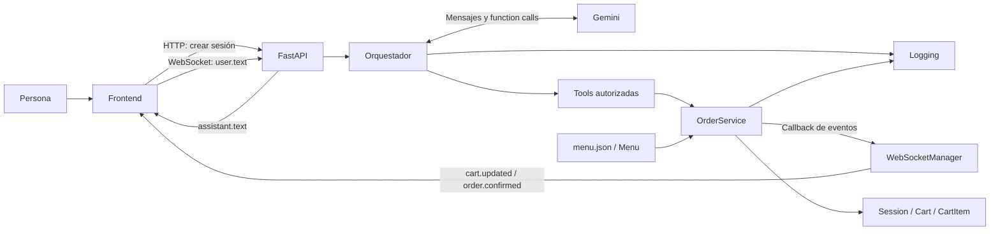
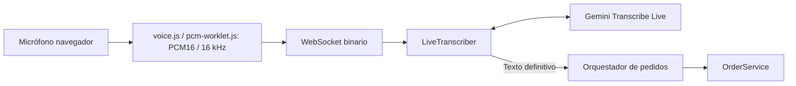
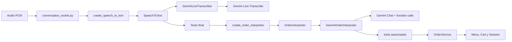

# Arquitectura y contratos actuales

Actualizada con [voz por turnos](voz.md) el 14/09/2026.

La captura y la conexión Live se preparan en paralelo. El frontend no habilita
el envío hasta recibir `voice.ready` y completar la preparación local, evitando
perder las primeras palabras por empezar a hablar durante el handshake.

## Visión general

Es una aplicación Python modular con FastAPI, un frontend de HTML/CSS/JavaScript
y Gemini como intérprete conversacional. No son microservicios: los módulos del
backend comparten un proceso y las sesiones viven en memoria.



El texto del asistente y el carrito tienen orígenes diferentes: Gemini redacta
el primero; el servicio construye el segundo. Una respuesta verbal nunca es, por
sí sola, evidencia de que un pedido se haya modificado.

## Mapa de módulos y funciones

| Archivo | Responsabilidad y puntos de entrada |
| --- | --- |
| `backend/domain/product.py` | `Product`, `ModifierGroup`, `ModifierOption`: estructura del catálogo y adicionales de precio. |
| `backend/domain/menu.py` | `load_menu()` convierte JSON a objetos; `Menu.get_product()` busca por identificador y `Menu.get_modifier_details()` transforma una seleccion interna ya validada en datos visibles para el frontend. |
| `backend/domain/cart_item.py` | `CartItem`: una línea con producto, cantidad, configuración y precio unitario. |
| `backend/domain/cart.py` | `Cart.total`: suma precio unitario por cantidad de cada línea. |
| `backend/domain/session.py` | `Session`: UUID, carrito independiente y estados `ACTIVE`, `PAYMENT_PENDING` y `CONFIRMED`. |
| `backend/services/order_service.py` | Validacion y mutacion mediante `add_item`, `remove_item`, `change_quantity`, `change_modifier`, `replace_item`, `clear_cart`, `prepare_payment`, `select_payment_method`, `return_to_order` y `complete_payment`; consulta mediante `get_cart`. |
| `backend/ai/tools.py` | Fábricas `create_*_tool`: crean funciones ligadas al servicio de una sesión y convierten resultados a diccionarios para Gemini. |
| `backend/ai/contracts.py` | Contratos `SpeechToText` y `OrderInterpreter`, sin dependencia de menú, carrito ni pagos. |
| `backend/ai/live_transcriber.py` | `GeminiLiveTranscriber`: implementación Gemini del contrato STT; `LiveTranscriber` es alias temporal. |
| `backend/ai/orchestrator.py` | `GeminiOrderInterpreter`: implementación Gemini de `OrderInterpreter`, tools e historial. |
| `backend/ai/errors.py` | `AIProviderError` y clasificadores de errores HTTP/transporte; conservan etapa y si el pedido ya cambió. |
| `backend/ai/factories.py` | `create_speech_to_text()` y `create_order_interpreter()` seleccionan el adaptador configurado. |
| `backend/api/app.py` | Sirve frontend, crea `SessionRuntime` con `OrderInterpreter`, expone HTTP y WebSocket y serializa estado. |
| `backend/api/websocket_manager.py` | Registra una conexión por sesión y publica eventos, incluso desde código en otro thread. |
| `backend/logging/event_logger.py` | `log_event()`, formatters y handlers: JSONL detallado, texto legible y consola, con rotación. |
| `config/settings.py` | `get_gemini_api_key()`: carga `.env` y obtiene la clave del entorno. |
| `config/menu.json` | Catálogo local cargado al importar la API; editarlo requiere recargar el proceso. |
| `frontend/index.html` | Panel conversacional, formulario, controles de micrófono/voz y carrito. |
| `frontend/app.js` | `createSession`, `connectWebSocket`, `sendMessage`, `renderCart`; captura y conversión de audio, estados visuales. |
| `frontend/styles.css` | Distribución de paneles, mensajes, carrito y adaptación a pantallas pequeñas. |
| `backend/ai/test_chat.py` | Chat manual de terminal usando el mismo orquestador y servicio. |

El dominio no importa Gemini, FastAPI ni el frontend. El servicio sí depende del
logger y de un callback opcional; la separación es útil pero no constituye una
arquitectura hexagonal completa con todos sus puertos formalizados.

## Recorrido de un pedido escrito

1. Al cargar la página, `createSession()` llama a `POST /api/sessions`.
2. La API crea `Session`, `OrderService` y un `OrderInterpreter` desde fábrica y los
   guarda en `sessions[session_id]`. Cada orquestador tiene su propio chat.
3. El navegador conecta `/ws/sessions/{session_id}` y envía `user.text`.
4. La API ejecuta `assistant.send_message()` mediante `asyncio.to_thread()` para
   no ejecutar la llamada síncrona a Gemini en el event loop del WebSocket.
5. Gemini recibe reglas y catálogo. Puede responder directamente o pedir una tool.
6. El orquestador verifica el nombre, ejecuta la función autorizada y devuelve
   su resultado a Gemini. `ValueError` de validación se convierte en un resultado
   estructurado que permite al modelo explicar el problema.
7. Una mutación válida llama a `_log_cart_updated()` y a `_emit_event()`.
   El callback programa la publicación del snapshot por WebSocket.
8. `renderCart()` actualiza productos e importe a partir de ese snapshot. La
   respuesta completa de Gemini llega aparte como `assistant.text`.

El cambio de carrito puede llegar antes de la respuesta textual final. No hay
streaming de tokens de respuesta ni procesamiento parcial de pedidos hablados.

## Tools y reglas

Las ocho tools expuestas son `add_item`, `get_cart`, `change_modifier`,
`replace_item`, `remove_item`, `confirm_order`, `select_payment_method` y
`return_to_order`. `change_quantity` y `clear_cart` existen en el servicio pero
no tienen una tool expuesta: no debe anunciarse que el bot las ejecuta directamente
por conversación.

`add_item` devuelve `needs_clarification` si no recibe cualquier grupo marcado
como obligatorio por el catálogo, sin modificar nada. Después el servicio verifica
producto, disponibilidad, cantidad positiva, grupos conocidos y opciones válidas.
Las tools reciben un diccionario `selected_modifiers`, por lo que no dependen de
nombres específicos como tamaño o bebida. Un grupo opcional puede quitarse con
`change_modifier` sin afectar los grupos obligatorios.

Los datos pendientes se conservan en el contexto conversacional del modelo;
no existe una entidad `PendingOrder`. La regla de que el usuario haya indicado
realmente cada opción depende de la interpretación y del prompt: el servicio
comprueba validez, pero no puede probar el origen de un valor enviado por el LLM.

El orquestador desactiva la ejecución automática de funciones del SDK. Admite
varias function calls distintas por respuesta y las ejecuta en el orden recibido,
hasta cinco ciclos de tools por mensaje. Rechaza una misma combinación de nombre
y argumentos repetida dentro del turno. Esto también puede rechazar consultas
repetidas legítimas; no es una garantía general contra duplicados entre mensajes
o reconexiones.

La confirmacion conversacional pasa primero la sesion a `PAYMENT_PENDING` y
genera el numero de pedido en backend. `select_payment_method` acepta `QR`,
`CARD` o `CASH`; el frontend completa la demo mediante un endpoint y recien
entonces la sesion pasa a `CONFIRMED`. El QR es un codigo escaneable de demo que contiene solo texto,
sin URL, datos de pago ni destino real; la tarjeta tampoco se envia ni se almacena.
Mientras el pago esta pendiente, `return_to_order` permite volver al carrito y
eliminar lineas sigue pasando por `OrderService`. Tras finalizar, la interfaz
muestra el numero de pedido, cuenta cinco segundos y crea otra sesion.
La confirmacion tambien puede iniciarse desde el boton del carrito sin pasar por
Gemini; las consultas de precios usan la informacion del catalogo y no mutan el
pedido.

### Estados de una sesion

| Estado | Cuando aparece | Operaciones y transicion permitida |
| --- | --- | --- |
| `ACTIVE` | Al crear la sesion o al volver desde pago. | Permite agregar, cambiar o eliminar. `prepare_payment()` la lleva a `PAYMENT_PENDING`. |
| `PAYMENT_PENDING` | Se confirmo el carrito para elegir QR, tarjeta o caja; el backend ya asigno numero de pedido. | No permite mutar el carrito. `select_payment_method()` guarda la eleccion; `complete_payment()` la lleva a `CONFIRMED`; `return_to_order()` recupera `ACTIVE` con el mismo carrito. |
| `CONFIRMED` | El pago demo se completo. | Es el estado final: el pedido no admite texto, voz ni cambios de carrito. El frontend inicia una sesion nueva luego de la cuenta regresiva. |

El flujo expuesto por el dashboard y las tools usa siempre
`ACTIVE -> PAYMENT_PENDING -> CONFIRMED`. No existe una operacion del servicio
que confirme directamente desde `ACTIVE`: todo pedido debe pasar por la eleccion
de pago, aunque la pasarela sea simulada en esta demo.

## Modelo de datos y precios

El menú contiene Burger Clásica (ARS 8.500 base) y Burger Doble (ARS 10.500
base). Ambas requieren una bebida —Coca-Cola, Sprite o agua— sin adicional.
Tomate, lechuga, jamón y queso son extras opcionales; cada uno suma ARS 1.000.
El catálogo declara el nombre visible, la obligatoriedad y las opciones de cada
grupo. El backend usa los identificadores técnicos solo para validar y entrega
los nombres visibles, el precio base y el adicional de cada opción al frontend.
Los aliases del producto también forman parte del catálogo conversacional: por
ejemplo, «hamburguesa simple» identifica a Burger Clásica.

```text
precio unitario = precio base + suma de adicionales elegidos
total de línea = precio unitario × cantidad
total del carrito = suma de totales de línea
```

Hoy los enteros representan pesos argentinos completos, según catálogo y renderizado.
No hay convención de centavos ni soporte explícito de múltiples monedas.
Una línea puede tener varias unidades solo si comparten configuración; dos
hamburguesas con bebidas o extras diferentes deben representarse en líneas distintas.

`line_id` usa `max(ids presentes) + 1`, por lo que puede reutilizar valores al
eliminar líneas. `replace_item` conserva ID y cantidad, valida el destino y
recién después modifica producto, opciones y precio.

El recorrido vigente usa `prepare_payment()` y `complete_payment()` para pasar
por los tres estados de pago. Despues de `CONFIRMED` las mutaciones estan
bloqueadas; la confirmacion sigue siendo local, sin una aceptacion externa.


`Menu.get_modifier_details()` no determina que modificadores debe pedir el bot ni
valida una seleccion nueva. Recibe el producto y las opciones que ya quedaron
validadas en `CartItem.selected_modifiers`, busca sus nombres y precios en el
catalogo y devuelve detalles aptos para la interfaz. Por ejemplo, traduce
`{"drink": "COCA", "extras": "ADD_TOMATO"}` a datos visibles como
"Bebida: Coca-Cola" y "Tomate + ARS 1.000". Asi el frontend no necesita conocer
identificadores tecnicos ni duplicar el catalogo.

## Contratos de transporte

| Canal | Entrada / respuesta |
| --- | --- |
| `GET /` y `/static/*` | HTML y recursos del frontend. |
| `GET /api/health` | Estado del proceso; no verifica Gemini. |
| `POST /api/sessions` | Devuelve `session_id`, `state`, `cart`. |
| `GET /api/sessions/{id}/cart` | Snapshot `{items, total, state}`. |
| `POST /api/sessions/{id}/messages` | Recibe `{message}`; devuelve texto, carrito, estado de cierre o error estructurado. El frontend actual usa WebSocket para el chat. |
| `DELETE /api/sessions/{id}/cart/items/{line_id}` | Elimina una línea completa del carrito validado. |
| `DELETE /api/sessions/{id}/cart/items/{line_id}/modifiers/{group_id}` | Quita un modificador opcional y recalcula la línea mediante `OrderService`. |
| `/ws/sessions/{id}` | Recibe JSON de texto y bytes de audio; publica los eventos siguientes. |

Ejemplo de entrada WebSocket:

```json
{"type":"user.text","data":{"message":"Quiero una Burger Clásica con Coca y queso"}}
```

| Evento de salida | Contenido principal de `data` |
| --- | --- |
| `connection.ready` | `session_id`, `state`, `cart` para sincronizar al conectar. |
| `assistant.text` | `text`, `session_closed`, `cart`. |
| `cart.updated` | `action`, `line_id`, `cart`. |
| `payment.pending`, `payment.method_selected` | Numero de pedido, metodo cuando corresponde y `cart` con el estado actualizado. |
| `order.confirmed` | `cart` con estado confirmado. |
| `voice.ready`, `voice.transcript`, `voice.error`, `voice.cancelled` | Protocolo de voz detallado en `voz.md`; reemplaza el acuse experimental `audio.received`. |
| `ai.error` | Tipo, código, etapa, `retryable`, `transaction_applied`, última tool y mensaje. |
| `client.error`, `backend.error` | Mensaje y, según el caso, tipo/origen. |

El callback de eventos evita importar WebSocket desde el servicio.
`send_event_threadsafe()` usa `asyncio.run_coroutine_threadsafe()`. El envío es
asíncrono y no se espera su resultado; no hay entrega garantizada ni replay.

## Audio integrado



La API delega el WebSocket en `conversation_socket.py`. La sesión reserva un turno
con `turn_lock`; la transcripción final sigue el mismo historial y tools que el
texto escrito. Los scripts Live anteriores siguen siendo experimentos separados.
El frontend lee la respuesta final con `speechSynthesis`; `toggleAssistantAudio()`
permite apagar y cancelar esa lectura. Detalles, límites y pruebas en [voz](voz.md).

## Observabilidad y errores

`events.jsonl` conserva eventos desde DEBUG, incluyendo texto, argumentos,
snapshots y errores. `runtime.log` y la consola muestran una selección más
compacta desde INFO. Los archivos rotan a 5 MB con tres respaldos por destino.
Los logs no son almacenamiento transaccional ni permiten restaurar sesiones.

`AIProviderError.transaction_applied` informa si alguna tool ya modificó el
pedido antes de una falla del proveedor. No revierte cambios ni indica que
todo un pedido de varias operaciones se haya completado. El HTTP devuelve
además el carrito actual; el WebSocket también incluye snapshot en la respuesta
final y los errores de interpretación, además de publicar eventos de estado.

Los fallos de Gemini durante voz pasan por la misma clasificación antes de
emitir `voice.error`. Un 404 informa el nombre del modelo configurado y aclara
si falló la transcripción en vivo; los detalles técnicos completos permanecen en
los logs. Así la persona puede corregir la configuración sin interpretar un
mensaje genérico de API y sin que el audio llegue a modificar el pedido.

## Comparación con la arquitectura objetivo del kiosco

La guía de Adrián describe una arquitectura de producción para un kiosco físico. El repositorio actual implementa una prueba de concepto avanzada y cubre principalmente las capas de interfaz, reconocimiento, comprensión y reglas transaccionales. La diferencia es de etapa y de alcance; no implica que el diseño actual contradiga la guía.

| Capa de la guía | Implementación actual | Evaluación |
| --- | --- | --- |
| Hardware y captura | Micrófono del navegador con `echoCancellation` y `noiseSuppression`; audio PCM mono a 16 kHz. | Adecuado para validar el flujo. Falta mic array con beamforming/AEC real, equipo industrial, pantalla táctil, pinpad y ticketeadora. |
| Interfaz/VUI | HTML, CSS y JavaScript servidos por FastAPI; WebSocket, transcripción provisional y respuesta hablada con `speechSynthesis`. | Resuelve la demo web y texto/voz por turnos. Faltan modo kiosco/PWA, indicador de volumen, detección de silencio, interrupciones y empaquetado de dispositivo. |
| STT | `SpeechToText` desacopla el WebSocket; `GeminiLiveTranscriber` es el adaptador actual hacia Gemini Transcribe Live. | Es el enfoque cloud de la gu?a, configurable y ?til para avanzar r?pido. Permite evaluar otro proveedor o motor local sin tocar el dominio, pero siguen pendientes mediciones reales de red y latencia. |
| NLU y extracción | Gemini Chat recibe el catálogo y solicita function calls; las tools delegan en `OrderService`. | En vez de confiar en un JSON libre, el LLM propone operaciones y el backend valida producto, disponibilidad, modificadores y precios. Esta separación protege el carrito y debe conservarse. |
| Negocio, pago y salida | `OrderService`, sesiones en memoria y pago demo con QR escaneable de texto, tarjeta simulada o caja. | La autoridad transaccional ya existe. Faltan persistencia, stock real, POS, KDS, pasarela certificada y emisión de ticket. |

### Qué conservar

Conviene conservar la separación `domain`/`services`/`ai`/`api`, porque permite cambiar Gemini, la interfaz de voz o el proveedor de pago sin trasladar reglas de negocio. También conviene conservar el mismo `OrderService` para texto, voz y controles de pantalla, la validación server-side y la separación entre transcripción provisional y carrito confirmado.

### Qué incorporar cuando el proyecto pase a piloto

La siguiente etapa técnica debería definir adaptadores explícitos para
`SpeechToText`, interpretación LLM, POS, KDS, pagos y ticket, medir la latencia
por etapa y probar el frontend con el micrófono elegido. Los adaptadores de voz e
interpretación permitirían comparar proveedores o seleccionar uno alternativo
sin cambiar `OrderService`. Después habría que agregar almacenamiento durable e
idempotencia de pedidos, métricas de cuota y disponibilidad del proveedor,
continuidad por pantalla/escritura y un flujo de pago certificado. El número de
tarjeta no debe capturarse en el navegador en una integración real: debe utilizarse
un pinpad o tokenización del proveedor.

El proyecto no debe incorporar hardware Edge, una PWA, un POS real o una pasarela real solo para parecerse a la guía. Cada integración debe entrar cuando exista un entorno de prueba y un contrato verificable.

## Justificación de las decisiones frente a la guía de Adrián

La guía propone un kiosco físico completo. El repositorio se encuentra en una etapa de validación del núcleo de software, por lo que cada decisión prioriza comprobar el recorrido de pedido antes de incorporar infraestructura externa.

### Por qué Gemini se usa con tools y no como generador de JSON final

Gemini se utiliza como intérprete de lenguaje y no como autoridad del pedido. Recibe el catálogo y solicita operaciones estructuradas mediante function calls. Cada operación es ejecutada por una tool adaptadora y validada por `OrderService`.

Esta elección se tomó porque un JSON generado libremente por el modelo todavía puede contener productos inexistentes, precios inventados, modificadores inválidos o cantidades ambiguas. Con tools, el modelo expresa una intención y el backend decide si esa intención es válida. El mismo servicio puede ser utilizado por texto, voz, botones y futuras integraciones, sin duplicar reglas.

La alternativa de JSON puede evaluarse más adelante como contrato de intercambio con un POS u otro servicio, pero no debe reemplazar la validación central del dominio.

### Por qué usamos STT cloud en esta etapa

La transcripción utiliza Gemini Transcribe Live porque permite probar el flujo con el micrófono disponible, sin comprar hardware ni mantener un modelo local. Esto reduce el tiempo hasta una demo funcional y mantiene una sola integración configurable mediante `.env`.

La contrapartida es la dependencia de internet, el costo por uso y una latencia que todavía debe medirse por etapa. Por eso la elección es válida para la prueba de concepto, pero queda abierta para el piloto físico. La configuración permite cambiar el modelo sin modificar el dominio ni el frontend.

### Por qué el frontend es web y el estado vive en backend

Una interfaz web permite probar rápidamente escritura, voz, carrito y pagos simulados desde cualquier equipo. El backend conserva el estado y valida las mutaciones para que la pantalla no pueda convertirse en la autoridad de precios o disponibilidad. En una instalación futura, esta misma interfaz puede ejecutarse en modo kiosco o empaquetarse como PWA sin cambiar `OrderService`.

### Por qué los pagos, POS y hardware quedan fuera de la demo

Una integración real depende del proveedor, del país, de certificaciones, del hardware disponible y del contrato con el local. Simular un pinpad, un POS o una pasarela como si fueran reales daría una falsa sensación de seguridad. Por eso el proyecto deja puntos de integración claros y usa pagos demo hasta contar con contratos y entornos de prueba verificables.

### Disponibilidad en el catalogo

`available` esta presente en productos base y en cada opcion de modificador.
`OrderService` rechaza una opcion agotada antes de crear, cambiar o reemplazar
una linea. Si un grupo obligatorio queda sin opciones disponibles, las tools
devuelven `unavailable_required_modifier` y no piden una seleccion imposible.
Gemini recibe el estado del catalogo para explicarlo, pero la autoridad final
sigue en el servicio.

Los grupos compartidos se declaran una sola vez en `modifier_groups` de
`config/menu.json`; cada producto los referencia con `modifier_group_ids`. Por
ejemplo, ambas hamburguesas usan el mismo grupo `drink`. Cambiar la disponibilidad
de Coca-Cola, tomate o cualquier extra afecta a todos los productos que lo usan.

### Recuperacion automatica del WebSocket

Ante un cierre inesperado, el frontend bloquea temporalmente escritura y voz,
cancela la captura local y reintenta el mismo `session_id` con espera progresiva
de uno, dos, cuatro y hasta quince segundos. No reenvia texto ni audio: una
operacion podria haber llegado al backend aunque se haya perdido la respuesta.
Al recibir `connection.ready`, reemplaza la vista con el snapshot del backend y
vuelve a habilitar la interfaz.

El cierre normal al crear otra sesion o abandonar la pagina no programa reintentos.
Si el backend responde 4404 porque ya no conserva esa sesion, por ejemplo despues
de reiniciarse, el frontend inicia una nueva de forma controlada. Las sesiones
siguen en memoria, por lo que una reconexion no recupera pedidos tras reiniciar el
proceso; esa garantia requiere persistencia.


## Adaptadores de IA implementados

La IA dejó de ser una dependencia directa de los bordes de la aplicación. Esta
separación se implementó el 16/09/2026 y no modifica `OrderService`,
`Menu`, `Cart`, precios, disponibilidad ni estados de pago.



`backend/ai/contracts.py` contiene dos contratos formales:

- `SpeechToText`: `feed()`, `finish()`, `cancel()`, `transcribe()` y `close()`.
  Por eso el WebSocket puede manejar audio por fragmentos, parciales, texto final,
  cancelación y liberación de recursos sin saber si el proveedor es Gemini, un
  servicio cloud u otro motor.
- `OrderInterpreter`: `send_message()` y `close()`. El intérprete puede traducir
  el lenguaje natural y administrar el protocolo de tools de su proveedor, pero
  no valida ni aplica reglas por cuenta propia: las tools autorizadas delegan en
  `OrderService`.

`backend/ai/factories.py` lee `STT_PROVIDER` y `LLM_PROVIDER` mediante
`config/settings.py`. Para voz, la fábrica implementa solamente `gemini` y
construye `GeminiLiveTranscriber`. Para chat, implementa `gemini`, `openai` y
`groq`, que construyen respectivamente `GeminiOrderInterpreter`,
`OpenAIOrderInterpreter` y `GroqOrderInterpreter`.
Los nombres anteriores, `LiveTranscriber` y `OrderConversationOrchestrator`, se
conservan como alias transitorios para que imports de pruebas o diagnósticos
existentes no rompan durante la transición. El código nuevo depende de los
contratos, no de esos alias.

Si se configura un proveedor futuro antes de agregar su adaptador, la fábrica
muestra un error explícito y no intenta leer claves de otro proveedor. Así una
combinación no queda aparentemente activa cuando en realidad no fue
implementada.

### Configuración y credenciales por combinación

| Selección | Variables que se exigen hoy | Variables de modelo |
| --- | --- | --- |
| `STT_PROVIDER=gemini`, `LLM_PROVIDER=gemini` | `GEMINI_API_KEY` una sola vez | `GEMINI_TRANSCRIPTION_MODEL`, `GEMINI_CHAT_MODEL` |
| `STT_PROVIDER=gemini`, `LLM_PROVIDER=groq` | `GEMINI_API_KEY` y `GROQ_API_KEY` | `GEMINI_TRANSCRIPTION_MODEL`, `GROQ_CHAT_MODEL` |
| `STT_PROVIDER=gemini`, `LLM_PROVIDER=openai` | `GEMINI_API_KEY` y `OPENAI_API_KEY` | `GEMINI_TRANSCRIPTION_MODEL`, `OPENAI_CHAT_MODEL` |
| Gemini + LLM futuro | `GEMINI_API_KEY` y la clave del LLM elegido al implementar su adaptador | Modelo Gemini STT y variable del LLM futuro |
| STT futuro + Gemini | Credencial o modelo local del STT y `GEMINI_API_KEY` | Variable STT futura y `GEMINI_CHAT_MODEL` |
| Ambos futuros | Solo credenciales o archivos de los proveedores seleccionados | Variables propias de los adaptadores |
| STT local | No necesita clave cloud para STT; sí `STT_MODEL_PATH` y el modelo instalado | Ruta, idioma y parámetros del motor local |

`.env.example` presenta la combinación activa recomendada Gemini STT + Groq LLM
y anota cómo cambiar a Gemini Chat u OpenAI. Las claves reales continúan fuera
de Git. Anthropic, `STT_MODEL_PATH` y otros proveedores futuros se documentan en
el README y en `docs/pendientes.md`, pero todavía no son configuraciones que el
código acepte.

### Candidatos investigados, no implementados

| Capa | Candidato | Qué requeriría el adaptador | Estado |
| --- | --- | --- | --- |
| STT cloud | OpenAI Realtime o transcripción | `OPENAI_API_KEY`, elegir protocolo de streaming, convertir parciales/finales a `SpeechToText` | Investigado; sin código ni prueba real. |
| STT cloud | Google Cloud Speech-to-Text | Credenciales de Google Cloud y cliente de streaming, distinto de la clave Gemini | Investigado; sin código ni prueba real. |
| STT cloud | Azure Speech | Clave o identidad de Azure, región y cliente de reconocimiento continuo | Investigado; sin código ni prueba real. |
| STT local | Whisper o faster-whisper | `STT_MODEL_PATH`, modelo descargado, CPU/GPU y segmentación de audio | Investigado; sin código ni prueba real. |
| STT local | Vosk | `STT_MODEL_PATH`, modelo Vosk e integración de parciales locales | Investigado; sin código ni prueba real. |
| LLM cloud | OpenAI | `OPENAI_API_KEY`, mapeo de function calling a las mismas tools autorizadas | Investigado; sin código ni prueba real. |
| LLM cloud | Anthropic | `ANTHROPIC_API_KEY`, mapeo de tool use a las mismas tools autorizadas | Investigado; sin código ni prueba real. |
| LLM local | Ollama con un modelo compatible | Servicio/modelo local y adaptación de tool calling; no API key cloud por defecto | Investigado; sin código ni prueba real. |

Las fuentes de cada candidato son la documentación oficial de
[OpenAI STT](https://developers.openai.com/api/docs/guides/speech-to-text),
[OpenAI Realtime](https://developers.openai.com/api/docs/guides/realtime),
[Google Cloud STT](https://cloud.google.com/speech-to-text/docs),
[Azure Speech](https://learn.microsoft.com/en-us/azure/ai-services/speech-service/speech-to-text),
[Whisper](https://github.com/openai/whisper), [Vosk](https://alphacephei.com/vosk/),
[Anthropic tool use](https://platform.claude.com/docs/en/agents-and-tools/tool-use/overview)
y [Ollama tool calling](https://docs.ollama.com/capabilities/tool-calling).
La documentación prueba que esas tecnologías existen y describe sus protocolos;
no prueba que rindan bien para este menú, micrófono, ruido o cuenta.

### Validación de esta arquitectura

El 16/09/2026 se ejecutaron pruebas automáticas sin red ni credenciales: una
simulación del SDK Live de Gemini, los flujos de WebSocket de voz, reglas del
pedido y pago, y una prueba nueva que conecta `AlternateSpeechToText` y
`AlternateOrderInterpreter` simulados con `OrderService` real. La última prueba
comprueba que el cambio de adaptador conserva el cálculo real de ARS 8.500 y que
un parcial no muta el carrito. No llama a Gemini, OpenAI, Anthropic, Whisper,
Vosk ni a otro proveedor; por lo tanto no mide disponibilidad, 503, latencia,
costo ni precisión de reconocimiento.


### OpenAI LLM: implementacion y evidencia

`LLM_PROVIDER=openai` crea `OpenAIOrderInterpreter`. El adaptador envia el
catalogo, traduce function calls de OpenAI a las tools autorizadas y devuelve los
resultados al historial antes de pedir la respuesta final. `OrderToolsRuntime`
conserva ejecucion, proteccion contra duplicados y sanitizacion sin depender de
un SDK de IA. STT sigue en Gemini; `STT_PROVIDER=openai` continua rechazado hasta
implementar un adaptador de streaming separado.

La cuenta consultada expone `gpt-4.1-mini`, `gpt-4.1`, `gpt-4o`, `gpt-4o-mini`,
`gpt-5-mini`, `gpt-5` y otros. Se eligio `gpt-4.1-mini` como primer modelo de
prueba por estar disponible y soportar function calling. El comando
`python -m backend.ai.list_openai_models` consulta la lista de la cuenta sin
revelar la clave.

La conexion real alcanzo OpenAI, que respondio `429 credit_balance_exhausted`.
La clave es valida pero la cuenta no posee creditos API: no hay prueba manual de
tools aprobada hasta agregar saldo. Ese error se clasifica como
`CREDIT_BALANCE_EXHAUSTED`, no como saturacion transitoria. Las simulaciones si
verifican OpenAI -> tool -> OrderService.

### Ajuste de cuota gratuita de Groq

La primera llamada real del 16/09/2026 autentico la cuenta Groq, pero recibio
429 antes de ejecutar tools: el valor predeterminado del SDK esperaba hasta
2.048 tokens de salida y el límite gratuito del modelo era 1.000. El adaptador
`GroqOrderInterpreter` establece `max_tokens=800`; la correccion conserva el
mismo contrato y las mismas tools. Falta repetir la conversación real para
validar el flujo completo.

**Evidencia manual de Groq (16/09/2026):** con `openai/gpt-oss-20b`, una
conversación de terminal real agregó una Burger Clásica con Agua mediante
`add_item`; `OrderService` devolvió una línea por ARS 8.500. Una secuencia
posterior también aplicó el agregado y eliminación de tomate. La prueba fue
contra la API real y no mide todavía el recorrido completo en navegador, voz,
pago ni carga sostenida.

Las respuestas conversacionales pasan por `OrderToolsRuntime.sanitize_user_text`
antes de llegar al frontend. Además de ocultar IDs internos, normaliza separadores
Unicode entre miles y formatos `$` o `ARS` a `pesos argentinos`; no calcula ni
altera el total del carrito, que continúa saliendo de `OrderService`.
