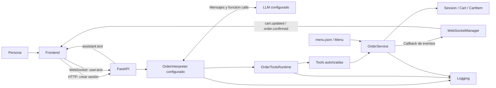
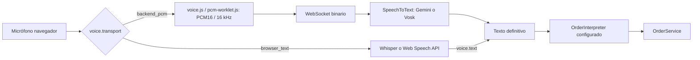
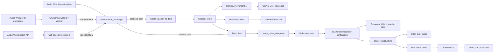

# Arquitectura y contratos actuales

## Visión general

Es una aplicación Python modular con FastAPI, un frontend de HTML/CSS/JavaScript
y proveedores configurables para transcripción e interpretación. La configuración
de ejemplo usa Web Speech API como STT y Groq como LLM; los STT contemplados son 
Web Speech API, Whisper en navegador, Vosk y Gemini Transcribe Live. Para interpretación 
del pedido están Gemini, OpenAI y Groq.. No son microservicios: los
módulos del backend comparten un proceso y las sesiones viven en memoria.



El texto del asistente y el carrito tienen orígenes diferentes: el intérprete y
el runtime construyen el primero; `OrderService` construye el segundo. Después
de una mutación, el texto se genera desde el carrito validado, pero la evidencia
del cambio sigue siendo el estado del servicio y no la frase del asistente.

## Mapa de módulos y funciones

| Archivo | Responsabilidad y puntos de entrada |
| --- | --- |
| `backend/domain/product.py` | `Product`, `ModifierGroup`, `ModifierOption`: estructura del catálogo y adicionales de precio. |
| `backend/domain/menu.py` | `load_menu()` convierte JSON a objetos y rechaza IDs o referencias duplicadas/inválidas; `Menu.get_product()` busca por identificador y `Menu.get_modifier_details()` transforma una seleccion interna ya validada en datos visibles para el frontend. |
| `backend/domain/cart_item.py` | `CartItem`: una línea con producto, cantidad, configuración y precio unitario. |
| `backend/domain/cart.py` | `Cart.total`: suma precio unitario por cantidad de cada línea. |
| `backend/domain/session.py` | `Session`: UUID, carrito independiente y estados `ACTIVE`, `PAYMENT_PENDING` y `CONFIRMED`. |
| `backend/services/order_service.py` | Validación y mutación mediante `add_item`, `remove_item`, `adjust_quantity`, `change_modifier`, `replace_item`, `clear_cart`, `prepare_payment`, `select_payment_method`, `return_to_payment_methods`, `return_to_order` y `complete_payment`; consulta mediante `get_cart`. |
| `backend/ai/tools.py` | Fábricas `create_*_tool`: crean funciones ligadas al servicio de una sesión y convierten resultados a diccionarios para el LLM configurado. Incluye `clear_cart` para vaciar el carrito en una sola operación. |
| `backend/ai/order_tool_specs.py` | Define una sola vez los nombres, descripciones y JSON Schema neutrales de las tools; cada adaptador los traduce al formato de su SDK. |
| `backend/ai/order_tools_runtime.py` | Construye la única instrucción de sistema común, liga las tools a `OrderService` y centraliza validación, ejecución ordenada, detección de mutaciones, respuestas posteriores y sanitización. |
| `backend/ai/contracts.py` | Contratos `SpeechToText` y `OrderInterpreter`, sin dependencia de menú, carrito ni pagos. |
| `backend/ai/pcm_streaming_turn.py` | `PcmStreamingSpeechToText`: cola, límites, finalización, cancelación y cierre compartidos por los STT que reciben PCM en el backend. |
| `backend/ai/gemini_transcriber.py` | `GeminiLiveTranscriber`: implementación Gemini del contrato STT. |
| `backend/ai/vosk_transcriber.py` | `VoskTranscriber`: implementación STT local que reutiliza un modelo indicado por `VOSK_MODEL_PATH`. |
| `backend/ai/gemini_llm_interpreter.py` | `GeminiOrderInterpreter`: implementación Gemini de `OrderInterpreter`, conservada para `LLM_PROVIDER=gemini`. |
| `backend/ai/openai_llm_interpreter.py` | `OpenAIOrderInterpreter`: implementación OpenAI de `OrderInterpreter`; requiere saldo de API. |
| `backend/ai/groq_llm_interpreter.py` | `GroqOrderInterpreter`: implementación Groq de `OrderInterpreter`, usada por la demo. |
| `backend/ai/errors.py` | `AIProviderError` y clasificadores de errores HTTP/transporte; conservan etapa y si el pedido ya cambió. |
| `backend/ai/factories.py` | `create_speech_to_text()` y `create_order_interpreter()` seleccionan el adaptador configurado. |
| `backend/ai/list_gemini_models.py`, `list_openai_models.py`, `list_groq_models.py` | Consultas de diagnóstico de los modelos visibles para cada cuenta, sin imprimir credenciales. |
| `backend/api/app.py` | Sirve frontend, crea `SessionRuntime` con `OrderInterpreter`, expone HTTP y WebSocket y serializa estado. |
| `backend/api/input_validation.py` | Normaliza turnos escritos y limita cada mensaje a 1.000 caracteres antes de reservar el intérprete o consumir cuota. |
| `backend/api/conversation_guards.py` | Detecta solicitudes de eliminación ambiguas y consultas explícitas del carrito antes del LLM; usa únicamente datos ya validados por `OrderService`. |
| `backend/api/websocket_manager.py` | Registra una conexión por sesión y publica eventos, incluso desde código en otro thread. |
| `backend/logging/event_logger.py` | `log_event()`, formatters y handlers: JSONL detallado, texto legible y consola, con rotación. |
| `config/settings.py` | Carga `.env`, selecciona proveedores y obtiene la credencial/modelo de cada capa. |
| `config/menu.json` | Catálogo local cargado al importar la API; editarlo requiere recargar el proceso. |
| `frontend/index.html` | Panel conversacional, catálogo visual animado de bebidas y extras, formulario, controles de micrófono/voz y carrito. |
| `frontend/app.js` | `createSession`, `connectWebSocket`, `sendMessage`, `renderCart`; captura y conversión de audio, estados visuales e integración de inactividad. |
| `frontend/inactivity.js` | `InactivityMonitor`: pregunta tras 30 segundos, advierte 20 segundos después y solicita una nueva sesión tras otros 20; permite reiniciar o detener el conteo. |
| `frontend/styles.css` | Distribución de paneles, mensajes, carrito y adaptación a pantallas pequeñas. |
| `backend/ai/test_chat.py` | Chat manual de terminal usando el intérprete elegido por `LLM_PROVIDER` y el servicio real. |

El dominio no importa el LLM, el STT, FastAPI o el frontend. El servicio sí depende del
logger y de un callback opcional; la separación es útil pero no constituye una
arquitectura hexagonal completa con todos sus puertos formalizados.

`OrderToolsRuntime.build_system_instruction()` es la única fuente de las reglas
conversacionales y transaccionales comunes. En cada sesión construye el texto con
el catálogo vigente, incluidos productos, aliases, precios, disponibilidad,
grupos de modificadores, obligatoriedad y opciones. `GeminiOrderInterpreter` lo
entrega como `system_instruction` de Gemini; `OpenAIOrderInterpreter` lo agrega
como mensaje `system`; `GroqOrderInterpreter` hereda este último flujo. Los
adaptadores conservan el SDK, la traducción del formato de function calling y
los errores propios de cada proveedor, pero no mantienen copias del prompt, los
metadatos, la validación ni la ejecución común de las tools.

## Recorrido de un pedido escrito

1. Al cargar la página, `createSession()` llama a `POST /api/sessions`.
2. La API crea `Session`, `OrderService` y un `OrderInterpreter` desde fábrica y los
   guarda en `sessions[session_id]`. Cada intérprete mantiene el historial de su sesión.
3. El navegador conecta `/ws/sessions/{session_id}` y envía `user.text`.
4. La API ejecuta `assistant.send_message()` mediante `asyncio.to_thread()` para
   no ejecutar la llamada síncrona al LLM configurado en el event loop del WebSocket.
5. El LLM recibe reglas y catálogo. Puede responder directamente o pedir una tool.
6. `OrderToolsRuntime` verifica el nombre y las repeticiones y ejecuta la función
   autorizada. `ValueError` se convierte en un resultado estructurado. Si no hubo
   mutación, el adaptador puede devolverlo al LLM para obtener una aclaración.
7. Una mutación válida llama a `_log_cart_updated()` y a `_emit_event()`.
   El callback programa la publicación del snapshot por WebSocket.
8. `renderCart()` actualiza productos e importe a partir de ese snapshot. La
   respuesta final, generada por el LLM o por el runtime, llega aparte como
   `assistant.text`.

El cambio de carrito puede llegar antes de la respuesta textual final. No hay
streaming de tokens de respuesta ni procesamiento parcial de pedidos hablados.
Después de una mutación válida sobre un carrito activo, el runtime reemplaza la
redacción libre del LLM por un resumen construido desde el carrito validado. Cada
producto ocupa una línea iniciada con un guion, expresa las cantidades unitarias
como `una unidad`, separa modificadores obligatorios y agrupa los adicionales
como `Extras`. El resumen omite precios por línea, que ya están en el carrito, y
comunica una sola vez el total y las opciones para continuar.

En Gemini, OpenAI y Groq, una mutación válida no genera una segunda llamada al LLM
solo para redactar la confirmación. `OrderToolsRuntime.get_post_mutation_response()`
construye la misma respuesta desde el estado validado, por lo que el turno termina
apenas concluyen las tools solicitadas. Los resultados sin mutación, como una
consulta o una validación fallida, sí pueden volver al proveedor para completar
la explicación o pedir el dato faltante.

La interfaz administra además la inactividad sin consultar al LLM. Después de
un mensaje escrito enviado o de una transcripción final de voz,
`InactivityMonitor` pregunta `¿Seguís ahí?` tras treinta segundos, advierte el cierre
veinte segundos después y crea una sesión vacía tras otros veinte segundos. Un
nuevo mensaje reinicia la secuencia; una sesión nueva, un movimiento del mouse o
un clic que no envía un pedido no inician el monitor y el conteo se detiene mientras voz o
texto se procesan.

## Tools y reglas

Las once tools expuestas son `add_item`, `get_cart`, `adjust_quantity`,
`change_modifier`, `replace_item`, `remove_item`, `clear_cart`, `confirm_order`,
`select_payment_method`, `return_to_payment_methods` y `return_to_order`.
`adjust_quantity` recibe una variación relativa: `-1` quita una unidad sin
borrar la línea. `remove_item` queda reservado para quitar la línea completa.

`add_item` devuelve `needs_clarification` si no recibe cualquier grupo marcado
como obligatorio por el catálogo, sin modificar nada. Después el servicio verifica
producto, disponibilidad, cantidad positiva, grupos conocidos y opciones válidas.
Las tools reciben un diccionario `selected_modifiers`, por lo que no dependen de
nombres específicos como tamaño o bebida. Un grupo opcional puede quitarse con
`change_modifier` sin afectar los grupos obligatorios.

Los datos pendientes se conservan en el contexto conversacional del modelo;
no existe una entidad `PendingOrder`. La regla de que el usuario haya indicado
realmente cada opción depende de la interpretación y del prompt: el servicio
comprueba validez, pero no puede probar el origen de un valor enviado por el LLM.
Las instrucciones de los adaptadores limitan las aclaraciones a grupos y opciones
presentes en el catálogo. Si ya se indicó el producto y cada grupo obligatorio,
el intérprete debe solicitar `add_item` sin inventar subtipos, presentaciones o
distinciones adicionales. `OrderService` vuelve a validar los identificadores
recibidos antes de modificar el carrito.

Antes de invocar al LLM, `conversation_socket.py` y el endpoint HTTP heredado usan
las guardas compartidas de `conversation_guards.py` para dos casos cerrados: si
una frase quiere eliminar o cambiar un producto, bebida o extra que aparece en
más de una línea y no identifica una configuración única, responde las
alternativas reales sin borrar ninguna; si pide ver el carrito, construye el
resumen desde `OrderService`. Esto evita que una respuesta o una tool propuesta
por un proveedor elimine varias líneas o afirme que el carrito está vacío cuando
los datos validados indican lo contrario.

Los adaptadores no delegan la ejecución automática de funciones al SDK.
`OrderToolsRuntime` admite varias function calls distintas por respuesta y las
ejecuta en el orden recibido, hasta cinco ciclos de tools por mensaje. Rechaza
una misma combinación de nombre y argumentos repetida dentro del turno. Esto
también puede rechazar consultas repetidas legítimas; no es una garantía general
contra duplicados entre mensajes o reconexiones.

La confirmacion conversacional pasa primero la sesion a `PAYMENT_PENDING` y
genera el numero de pedido en backend. Si la persona indica directamente un
método desde `ACTIVE`, `select_payment_method` prepara ese estado antes de
registrarlo. La tool acepta `QR`, `CARD` o `CASH`; el frontend completa la demo mediante un endpoint y recien
entonces la sesion pasa a `CONFIRMED`. El QR es un codigo escaneable de demo que contiene solo texto,
sin URL, datos de pago ni destino real; la tarjeta tampoco se envia ni se almacena.
Mientras el pago esta pendiente, `return_to_order` permite volver al carrito y
eliminar lineas sigue pasando por `OrderService`. Tras finalizar, la interfaz
muestra el numero de pedido y crea otra sesion al terminar la cuenta regresiva.
QR y caja simulan el procesamiento durante veinte segundos antes de confirmar;
tarjeta confirma cuando la persona ingresa cualquier número y toca **Continuar**.
En los tres casos, la confirmación y el número de pedido permanecen diez segundos
antes de crear otra sesión.
La confirmacion tambien puede iniciarse desde el boton del carrito sin pasar por
el LLM configurado; las consultas de precios usan la informacion del catalogo y no mutan el
pedido.

Después de seleccionar QR, tarjeta o caja, el frontend oculta el título y los
otros métodos. El botón **Atrás** de ese detalle ejecuta
`return_to_payment_methods()`: mantiene `PAYMENT_PENDING`, el número y el
carrito, pero limpia `payment_method` para volver a mostrar el selector. El
**Atrás** del selector usa `return_to_order()` y recién entonces habilita la
edición de productos. La conversación dispone de las mismas dos operaciones.

### Estados de una sesion

| Estado | Cuando aparece | Operaciones y transicion permitida |
| --- | --- | --- |
| `ACTIVE` | Al crear la sesion o al volver desde pago. | Permite agregar, cambiar o eliminar. `prepare_payment()` la lleva a `PAYMENT_PENDING`. |
| `PAYMENT_PENDING` | Se confirmo el carrito para elegir QR, tarjeta o caja; el backend ya asigno numero de pedido. | No permite mutar el carrito. `select_payment_method()` guarda la eleccion; `return_to_payment_methods()` limpia solo esa elección; `complete_payment()` la lleva a `CONFIRMED`; `return_to_order()` recupera `ACTIVE` con el mismo carrito. |
| `CONFIRMED` | El pago demo se completo. | Es el estado final: el pedido no admite texto, voz ni cambios de carrito. El frontend inicia una sesion nueva luego de la cuenta regresiva. |

El flujo expuesto por el dashboard y las tools usa siempre
`ACTIVE -> PAYMENT_PENDING -> CONFIRMED`. No existe una operacion del servicio
que confirme directamente desde `ACTIVE`: todo pedido debe pasar por la eleccion
de pago, aunque la pasarela sea simulada en esta demo.
Cuando una frase en `ACTIVE` ya contiene un método inequívoco,
`select_payment_method()` atraviesa `PAYMENT_PENDING` sin publicar el selector
intermedio; la regla de estados se conserva y la pantalla muestra directamente
el método que la persona pidió.

## Modelo de datos y precios

El menú contiene Burger Clásica (ARS 8.500 base) y Burger Doble (ARS 10.500
base). Ambas requieren una bebida —Coca-Cola, Sprite o agua— sin adicional.
Tomate, lechuga, jamón y queso son extras opcionales; cada uno suma ARS 1.000.
El catálogo declara el nombre visible, la obligatoriedad y las opciones de cada
grupo. El backend usa los identificadores técnicos solo para validar y entrega
los nombres visibles, el precio base y el adicional de cada opción al frontend.
Los aliases del producto también forman parte del catálogo conversacional: por
ejemplo, «hamburguesa simple» identifica a Burger Clásica.

```text
precio unitario = precio base + suma de adicionales elegidos
total de línea = precio unitario × cantidad
total del carrito = suma de totales de línea
```

Hoy los enteros representan pesos argentinos completos, según catálogo y renderizado.
No hay convención de centavos ni soporte explícito de múltiples monedas.
Una línea puede tener varias unidades solo si comparten configuración. Cuando
`add_item` recibe nuevamente el mismo producto con los mismos modificadores,
`OrderService` suma la cantidad sobre la línea existente. Si `change_modifier`
o `replace_item` vuelven idéntica una línea a otra que ya existe, también las
consolida. Dos hamburguesas con bebidas o extras diferentes se mantienen en
líneas distintas.

Cada sesión conserva un contador monotónico `next_line_id`: una línea nueva
recibe un identificador que no se reutiliza aunque se haya eliminado otra. Así,
un click o evento atrasado no puede afectar por error a un producto creado más
tarde con el mismo identificador. `replace_item` conserva cantidad, valida el
destino antes de mutar y puede terminar consolidando su resultado.

El recorrido vigente usa `prepare_payment()` y `complete_payment()` para pasar
por los tres estados de pago. Despues de `CONFIRMED` las mutaciones estan
bloqueadas; la confirmacion sigue siendo local, sin una aceptacion externa.


`Menu.get_modifier_details()` no determina que modificadores debe pedir el bot ni
valida una seleccion nueva. Recibe el producto y las opciones que ya quedaron
validadas en `CartItem.selected_modifiers`, busca sus nombres y precios en el
catalogo y devuelve detalles aptos para la interfaz. Por ejemplo, traduce
`{"drink": "COCA", "extras": "ADD_TOMATO"}` a datos visibles como
"Bebida: Coca-Cola" y "Tomate + ARS 1.000". Asi el frontend no necesita conocer
identificadores tecnicos ni duplicar el catalogo.

## Contratos de transporte

| Canal | Entrada / respuesta |
| --- | --- |
| `GET /` y `/static/*` | HTML y recursos del frontend. |
| `GET /api/health` | Estado del proceso; no verifica disponibilidad de los proveedores de IA. |
| `POST /api/sessions` | Devuelve `session_id`, `state`, `cart`. |
| `GET /api/sessions/{id}/cart` | Snapshot `{items, total, state}`. |
| `POST /api/sessions/{id}/messages` | Recibe `{message}` de hasta 1.000 caracteres; devuelve texto, carrito, estado de cierre o error estructurado. El frontend actual usa WebSocket para el chat. |
| `DELETE /api/sessions/{id}/cart/items/{line_id}` | Elimina una línea completa del carrito validado. |
| `DELETE /api/sessions/{id}/cart/items/{line_id}/modifiers/{group_id}` | Quita un modificador opcional y recalcula la línea mediante `OrderService`. |
| `/ws/sessions/{id}` | Recibe JSON de texto y bytes de audio; publica los eventos siguientes. |

El HTML y los recursos bajo `/static/` se entregan sin caché durante esta etapa
de desarrollo. Además, las referencias principales incluyen una versión. Esto
evita que el navegador conserve JavaScript o CSS anteriores después de una
corrección y muestre un comportamiento distinto del código que ejecuta el
backend.

Ejemplo de entrada WebSocket:

```json
{"type":"user.text","data":{"message":"Quiero una Burger Clásica con Coca y queso"}}
```

| Evento de salida | Contenido principal de `data` |
| --- | --- |
| `connection.ready` | `session_id`, `state`, `cart` y configuración pública `voice` (`provider`, `transport` y opciones seguras) para sincronizar al conectar. |
| `assistant.text` | `text`, `session_closed`, `cart`. |
| `cart.updated` | `action`, `line_id`, `cart`. |
| `payment.pending`, `payment.method_selected` | Numero de pedido, metodo cuando corresponde y `cart` con el estado actualizado. |
| `order.confirmed` | `cart` con estado confirmado. |
| `voice.ready`, `voice.transcript`, `voice.error`, `voice.cancelled`, `voice.retry_ready` | Protocolo de voz detallado en `voz.md`; `voice.retry_ready` confirma que se liberó un fallo de STT antes de aceptar otro turno. Reemplazan el acuse experimental `audio.received`. |
| `ai.error` | Tipo, código, etapa, `retryable`, `transaction_applied`, última tool y mensaje. |
| `client.error`, `backend.error` | Mensaje y, según el caso, tipo/origen. |

El frontend trata `payment.method_selected` como una actualización prioritaria:
usa su `cart` validado para mostrar de inmediato el QR, el formulario de tarjeta
o el número de pedido para caja. La respuesta textual del LLM puede llegar
después y solo aporta la explicación conversacional.
El título y los botones para elegir método se muestran únicamente mientras
`payment_method` sea nulo; al existir una elección, queda visible solo el flujo
correspondiente a QR, tarjeta o caja.
Ese snapshot incluye `payment_method` y `order_number`; así, aunque los eventos
asíncronos lleguen muy próximos, ninguno puede reconstruir el panel con datos de
pago incompletos.

Durante `ACTIVE` o `PAYMENT_PENDING`, `conversation_socket.py` reconoce localmente
una solicitud explícita de QR, tarjeta o caja y la delega a `OrderService`. Esto evita
una llamada innecesaria al LLM para una selección cerrada y reduce la latencia;
las frases ambiguas siguen el flujo normal del intérprete. Las preguntas como
«¿con qué puedo pagar?» se responden localmente enumerando QR, tarjeta y caja,
sin preparar el pago ni elegir una opción por la persona.

Mientras un turno de voz está en curso, `frontend/app.js` reemplaza los botones
de pago por un aviso de procesamiento. Así se evita que la persona duplique la
selección con un clic antes de recibir el resultado del turno.

Las instrucciones del intérprete exigen enumerar el carrito o preguntar el dato
obligatorio faltante. Como defensa adicional, si el proveedor termina con una
referencia vacía como “el carrito queda así”, `OrderToolsRuntime` la reemplaza
por un resumen construido desde el carrito validado por `OrderService`.
Los adaptadores compatibles con Chat Completions también detectan respuestas
vacías, palabras truncadas y cortesías aisladas. Si todavía no hubo una mutación,
solicitan un solo reprocesamiento; si vuelve a fallar, informan que el carrito no
cambió. Si la operación ya se aplicó, no vuelven a pedir tools y remiten al carrito
visible para evitar duplicar una mutación.

El callback de eventos evita importar WebSocket desde el servicio.
`send_event_threadsafe()` usa `asyncio.run_coroutine_threadsafe()`. El envío es
asíncrono y no se espera su resultado; no hay entrega garantizada ni replay.

## Audio integrado



La API delega el WebSocket en `conversation_socket.py`. La sesión reserva un turno
con `turn_lock`; la transcripción final sigue el mismo historial y tools que el
texto escrito. Los experimentos Live temporales que ya no aportaban cobertura
se eliminaron; la regresión útil permanece en `tests/test_voice.py`.
El frontend lee la respuesta final con `speechSynthesis`; `toggleAssistantAudio()`
permite apagar y cancelar esa lectura. Detalles, límites y pruebas en [voz](voz.md).

## Observabilidad y errores

`events.jsonl` conserva eventos estructurados desde DEBUG, incluidos snapshots
de carrito y detalles de errores cuando el evento los aporta. Las corridas
actuales registran longitudes y duraciones de voz y conversación, pero no el
contenido de cada transcripción. `runtime.log` y la consola muestran una
selección más compacta desde INFO. Los archivos rotan a 5 MB con tres respaldos
por destino. Los logs no son almacenamiento transaccional ni permiten restaurar
sesiones.

`AIProviderError.transaction_applied` informa si alguna tool ya modificó el
pedido antes de una falla del proveedor. No revierte cambios ni indica que
todo un pedido de varias operaciones se haya completado. El HTTP devuelve
además el carrito actual; el WebSocket también incluye snapshot en la respuesta
final y los errores de interpretación, además de publicar eventos de estado.

Los fallos del proveedor STT durante voz pasan por la misma clasificación antes de
emitir `voice.error`. Un 404 informa el nombre del modelo configurado y aclara
si falló la transcripción en vivo; los detalles técnicos completos permanecen en
los logs. Así la persona puede corregir la configuración sin interpretar un
mensaje genérico de API y sin que el audio llegue a modificar el pedido.

### Qué incorporar cuando el proyecto pase a piloto

La siguiente etapa técnica debería conservar los contratos ya implementados de
`SpeechToText` y `OrderInterpreter`, completar la comparación real de sus
adaptadores y definir contratos equivalentes para POS, KDS, pagos y ticket.
También debe medir la latencia por etapa y probar el frontend con el micrófono
elegido. Después habría que agregar almacenamiento durable e idempotencia de
pedidos, métricas de cuota y disponibilidad del proveedor, continuidad por
pantalla/escritura y un flujo de pago certificado. El número de tarjeta no debe
capturarse en el navegador en una integración real: debe utilizarse un pinpad o
tokenización del proveedor.

El proyecto no debe incorporar hardware Edge, una PWA, un POS real o una pasarela real solo para parecerse a la guía. Cada integración debe entrar cuando exista un entorno de prueba y un contrato verificable.

### Por qué el LLM usa tools y no genera el JSON final

El LLM configurado se utiliza como intérprete de lenguaje y no como autoridad del pedido. Recibe el catálogo y solicita operaciones estructuradas mediante function calls. Cada operación es ejecutada por una tool adaptadora y validada por `OrderService`.

Esta elección se tomó porque un JSON generado libremente por el modelo todavía puede contener productos inexistentes, precios inventados, modificadores inválidos o cantidades ambiguas. Con tools, el modelo expresa una intención y el backend decide si esa intención es válida. El mismo servicio puede ser utilizado por texto, voz, botones y futuras integraciones, sin duplicar reglas.

La alternativa de JSON puede evaluarse más adelante como contrato de intercambio con un POS u otro servicio, pero no debe reemplazar la validación central del dominio.

### Disponibilidad en el catalogo

`available` esta presente en productos base y en cada opcion de modificador.
`OrderService` rechaza una opcion agotada antes de crear, cambiar o reemplazar
una linea. Si un grupo obligatorio queda sin opciones disponibles, las tools
devuelven `unavailable_required_modifier` y no piden una seleccion imposible.
El LLM recibe el estado del catalogo para explicarlo, pero la autoridad final
sigue en el servicio.

Antes de pasar de `ACTIVE` a `PAYMENT_PENDING`, `prepare_payment()` vuelve a
verificar que cada producto y opción ya incorporados siga disponible. Conserva
el precio aceptado de la línea, pero bloquea el pago si el catálogo cambió a
agotado mientras la persona revisaba el carrito.

Los grupos compartidos se declaran una sola vez en `modifier_groups` de
`config/menu.json`; cada producto los referencia con `modifier_group_ids`. Por
ejemplo, ambas hamburguesas usan el mismo grupo `drink`. Cambiar la disponibilidad
de Coca-Cola, tomate o cualquier extra afecta a todos los productos que lo usan.

Al cargar el archivo, `load_menu()` rechaza IDs repetidos de productos, grupos u
opciones; también rechaza referencias a grupos compartidos inexistentes o
repetidas dentro de un mismo producto. Esto evita que una edición del JSON
sobrescriba silenciosamente un producto o cobre dos veces el mismo grupo.

### Recuperacion automatica del WebSocket

Ante un cierre inesperado, el frontend bloquea temporalmente escritura y voz,
cancela la captura local y reintenta el mismo `session_id` con espera progresiva
de uno, dos, cuatro y hasta quince segundos. No reenvia texto ni audio: una
operacion podria haber llegado al backend aunque se haya perdido la respuesta.
Al recibir `connection.ready`, reemplaza la vista con el snapshot del backend y
vuelve a habilitar la interfaz.

El cierre normal al crear otra sesion o abandonar la pagina no programa reintentos.
Si el backend responde 4404 porque ya no conserva esa sesion, por ejemplo despues
de reiniciarse, el frontend inicia una nueva de forma controlada. Las sesiones
siguen en memoria, por lo que una reconexion no recupera pedidos tras reiniciar el
proceso; esa garantia requiere persistencia.


## Adaptadores de IA implementados

La IA dejó de ser una dependencia directa de los bordes de la aplicación. Esta
separación se implementó el 16/09/2026 y no modifica `OrderService`,
`Menu`, `Cart`, precios, disponibilidad ni estados de pago.



`backend/ai/contracts.py` contiene dos contratos formales:

- `SpeechToText`: `feed()`, `finish()`, `cancel()`, `transcribe()` y `close()`.
  Por eso el WebSocket puede manejar audio por fragmentos, parciales, texto final,
  cancelación y liberación de recursos sin saber si el proveedor es Gemini, un
  servicio cloud u otro motor.
- `OrderInterpreter`: `send_message()` y `close()`. El intérprete puede traducir
  el lenguaje natural y administrar el protocolo de tools de su proveedor, pero
  no valida ni aplica reglas por cuenta propia: las tools autorizadas delegan en
  `OrderService`.

`backend/ai/factories.py` lee `STT_PROVIDER` y `LLM_PROVIDER` mediante
`config/settings.py`. Para voz que llega como PCM al backend, la fábrica implementa `gemini` y `vosk`, y
construye respectivamente `GeminiLiveTranscriber` o `VoskTranscriber`. Para chat, implementa `gemini`, `openai` y
`groq`, que construyen respectivamente `GeminiOrderInterpreter`,
`OpenAIOrderInterpreter` y `GroqOrderInterpreter`.
Los nombres históricos `LiveTranscriber` y `OrderConversationOrchestrator`
no se conservan en el código actual: los módulos y clases explícitos identifican
proveedor y tipo de IA. El código de borde depende de los contratos.

Gemini y Vosk heredan de `PcmStreamingSpeechToText`, que mantiene una única
implementación de la cola acotada, los límites de fragmento y duración, el final
del audio, la cancelación segura y el cierre. El evento `connection.ready`
publica además `voice.transport`: `backend_pcm` indica que el navegador debe
enviar audio, y `browser_text` que debe enviar solamente `voice.text`. Backend y
frontend deciden la ruta mediante ese atributo, sin repetir una lista de
proveedores de navegador.

Con transporte `backend_pcm`, la captura y el adaptador STT se preparan en
paralelo. El frontend no habilita el envío hasta recibir `voice.ready` y
completar la preparación local, evitando perder las primeras palabras durante
el inicio del turno. Los STT de navegador preparan su propio capturador.

`STT_PROVIDER=whisper_browser` es una tercera ruta implementada. No se crea en
la fábrica porque el audio no atraviesa el backend: `BrowserWhisperInput` y
`whisper-browser-worker.js` capturan y transcriben localmente en el navegador.
Al terminar, publican `voice.text`; `conversation_socket.py` aplica el mismo
límite de entrada, reserva de turno, presentación de transcripción final e
intérprete LLM. La configuración pública del modelo se envía en
`connection.ready`, sin claves ni rutas privadas. Al elegir esta ruta no se abre
el `AudioWorklet` de Gemini/Vosk, por lo que nunca hay dos capturas del mismo
micrófono.

`STT_PROVIDER=web_speech_browser` reutiliza esa frontera de texto final mediante
`BrowserSpeechApiInput`. El navegador controla el motor de reconocimiento; el
proyecto solo publica `SPEECH_API_LANGUAGE` y no inventa una variable de modelo.
Su audio tampoco llega al backend de la aplicación.

Si se configura un proveedor futuro antes de agregar su adaptador, la fábrica
muestra un error explícito y no intenta leer claves de otro proveedor. Así una
combinación no queda aparentemente activa cuando en realidad no fue
implementada.

### Configuración y credenciales por combinación

| Selección | Variables que se exigen hoy | Variables de modelo |
| --- | --- | --- |
| `STT_PROVIDER=gemini`, `LLM_PROVIDER=gemini` | `GEMINI_API_KEY` una sola vez | `GEMINI_TRANSCRIPTION_MODEL`, `GEMINI_CHAT_MODEL` |
| `STT_PROVIDER=gemini`, `LLM_PROVIDER=groq` | `GEMINI_API_KEY` y `GROQ_API_KEY` | `GEMINI_TRANSCRIPTION_MODEL`, `GROQ_CHAT_MODEL` |
| `STT_PROVIDER=gemini`, `LLM_PROVIDER=openai` | `GEMINI_API_KEY` y `OPENAI_API_KEY` | `GEMINI_TRANSCRIPTION_MODEL`, `OPENAI_CHAT_MODEL` |
| `STT_PROVIDER=vosk`, `LLM_PROVIDER=groq` | `VOSK_MODEL_PATH` y `GROQ_API_KEY` | Ruta de modelo Vosk, `GROQ_CHAT_MODEL` |
| `STT_PROVIDER=whisper_browser`, `LLM_PROVIDER=groq` | `GROQ_API_KEY`; Whisper no requiere clave | `WHISPER_BROWSER_MODEL`, `WHISPER_BROWSER_DEVICE`, `GROQ_CHAT_MODEL` |
| `STT_PROVIDER=web_speech_browser`, `LLM_PROVIDER=groq` | `GROQ_API_KEY`; Web Speech API no requiere clave propia | `SPEECH_API_LANGUAGE`, `GROQ_CHAT_MODEL`; no existe modelo seleccionable |
| Gemini + LLM futuro | `GEMINI_API_KEY` y la clave del LLM elegido al implementar su adaptador | Modelo Gemini STT y variable del LLM futuro |
| STT futuro + Gemini | Credencial o modelo local del STT y `GEMINI_API_KEY` | Variable STT futura y `GEMINI_CHAT_MODEL` |
| Ambos futuros | Solo credenciales o archivos de los proveedores seleccionados | Variables propias de los adaptadores |
| STT local Vosk | No necesita clave cloud para STT; sí `VOSK_MODEL_PATH` y el modelo instalado | Ruta, idioma y parámetros del motor local |
| STT local Whisper navegador | No necesita clave cloud ni ruta de servidor; requiere descargar el modelo en caché del navegador | `WHISPER_BROWSER_MODEL`, `WHISPER_BROWSER_DEVICE` |

`.env.example` presenta la combinación activa recomendada Vosk STT + Groq LLM
y anota cómo cambiar a Whisper en navegador, Gemini Chat u OpenAI. Las claves reales y los
modelos locales continúan fuera de Git. Anthropic y otros proveedores futuros
se documentan en el README y en `docs/pendientes.md`, pero todavía no son
configuraciones que el código acepte.

### Candidatos investigados y estado de integración

| Capa | Candidato | Qué requeriría el adaptador | Estado |
| --- | --- | --- | --- |
| STT cloud | OpenAI Realtime o transcripción | `OPENAI_API_KEY`, elegir protocolo de streaming, convertir parciales/finales a `SpeechToText` | Investigado; sin código ni prueba real. |
| STT cloud | Google Cloud Speech-to-Text | Credenciales de Google Cloud y cliente de streaming, distinto de la clave Gemini | Investigado; sin código ni prueba real. |
| STT cloud | Azure Speech | Clave o identidad de Azure, región y cliente de reconocimiento continuo | Investigado; sin código ni prueba real. |
| STT local navegador | Whisper con Transformers.js | Modelo de Hugging Face, WebGPU o WebAssembly, Worker y texto final al WebSocket | Implementado con `onnx-community/whisper-tiny`; pruebas simuladas de transporte, falta comparación real de calidad y latencia. |
| STT local | Vosk | `VOSK_MODEL_PATH`, modelo Vosk y PCM16 a 16 kHz | Adaptador implementado con pruebas automáticas y corridas exploratorias reales; confundió términos como Sprite y QR, por lo que falta una comparación controlada. |
| LLM cloud | OpenAI | `OPENAI_API_KEY`, mapeo de function calling a las mismas tools autorizadas | Adaptador implementado y probado con simulaciones; la prueba real quedó bloqueada por falta de saldo API. |
| LLM cloud | Anthropic | `ANTHROPIC_API_KEY`, mapeo de tool use a las mismas tools autorizadas | Investigado; sin código ni prueba real. |
| LLM local | Ollama con un modelo compatible | Servicio/modelo local y adaptación de tool calling; no API key cloud por defecto | Investigado; sin código ni prueba real. |

Las fuentes de cada candidato son la documentación oficial de
[OpenAI STT](https://developers.openai.com/api/docs/guides/speech-to-text),
[OpenAI Realtime](https://developers.openai.com/api/docs/guides/realtime),
[Google Cloud STT](https://cloud.google.com/speech-to-text/docs),
[Azure Speech](https://learn.microsoft.com/en-us/azure/ai-services/speech-service/speech-to-text),
[Whisper](https://github.com/openai/whisper), [Vosk](https://alphacephei.com/vosk/),
[Anthropic tool use](https://platform.claude.com/docs/en/agents-and-tools/tool-use/overview)
y [Ollama tool calling](https://docs.ollama.com/capabilities/tool-calling).
La documentación prueba que esas tecnologías existen y describe sus protocolos;
no prueba que rindan bien para este menú, micrófono, ruido o cuenta.
