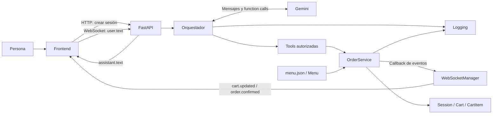
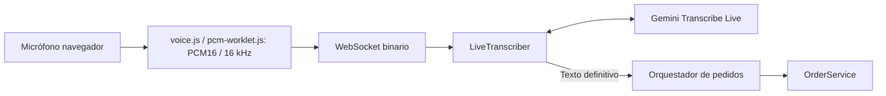

# Arquitectura y contratos actuales

Actualizada con [voz por turnos](voz.md) el 14/09/2026.

La captura y la conexión Live se preparan en paralelo. El frontend no habilita
el envío hasta recibir `voice.ready` y completar la preparación local, evitando
perder las primeras palabras por empezar a hablar durante el handshake.

## Visión general

Es una aplicación Python modular con FastAPI, un frontend de HTML/CSS/JavaScript
y Gemini como intérprete conversacional. No son microservicios: los módulos del
backend comparten un proceso y las sesiones viven en memoria.



El texto del asistente y el carrito tienen orígenes diferentes: Gemini redacta
el primero; el servicio construye el segundo. Una respuesta verbal nunca es, por
sí sola, evidencia de que un pedido se haya modificado.

## Mapa de módulos y funciones

| Archivo | Responsabilidad y puntos de entrada |
| --- | --- |
| `backend/domain/product.py` | `Product`, `ModifierGroup`, `ModifierOption`: estructura del catálogo y adicionales de precio. |
| `backend/domain/menu.py` | `load_menu()` convierte JSON a objetos; `Menu.get_product()` busca por identificador. |
| `backend/domain/cart_item.py` | `CartItem`: una línea con producto, cantidad, configuración y precio unitario. |
| `backend/domain/cart.py` | `Cart.total`: suma precio unitario por cantidad de cada línea. |
| `backend/domain/session.py` | `Session`: UUID, carrito independiente y estado `ACTIVE` o `CONFIRMED`. |
| `backend/services/order_service.py` | Validación y mutación mediante `add_item`, `remove_item`, `change_quantity`, `change_modifier`, `replace_item`, `clear_cart`, `confirm_order`; consulta mediante `get_cart`. |
| `backend/ai/tools.py` | Fábricas `create_*_tool`: crean funciones ligadas al servicio de una sesión y convierten resultados a diccionarios para Gemini. |
| `backend/ai/orchestrator.py` | `OrderConversationOrchestrator`: instrucciones, catálogo, historial conversacional del chat, control y ejecución manual de tools. |
| `backend/ai/gemini_client.py` | `create_gemini_client()`: construye el cliente autenticado del SDK. |
| `backend/ai/errors.py` | `AIProviderError` y clasificadores de errores HTTP/transporte; conservan etapa y si el pedido ya cambió. |
| `backend/api/app.py` | Sirve frontend, crea `SessionRuntime`, expone HTTP y WebSocket, serializa estado y traduce errores. Es el punto de ensamblado. |
| `backend/api/websocket_manager.py` | Registra una conexión por sesión y publica eventos, incluso desde código en otro thread. |
| `backend/logging/event_logger.py` | `log_event()`, formatters y handlers: JSONL detallado, texto legible y consola, con rotación. |
| `config/settings.py` | `get_gemini_api_key()`: carga `.env` y obtiene la clave del entorno. |
| `config/menu.json` | Catálogo local cargado al importar la API; editarlo requiere recargar el proceso. |
| `frontend/index.html` | Panel conversacional, formulario, controles de micrófono/voz y carrito. |
| `frontend/app.js` | `createSession`, `connectWebSocket`, `sendMessage`, `renderCart`; captura y conversión de audio, estados visuales. |
| `frontend/styles.css` | Distribución de paneles, mensajes, carrito y adaptación a pantallas pequeñas. |
| `backend/ai/test_chat.py` | Chat manual de terminal usando el mismo orquestador y servicio. |

El dominio no importa Gemini, FastAPI ni el frontend. El servicio sí depende del
logger y de un callback opcional; la separación es útil pero no constituye una
arquitectura hexagonal completa con todos sus puertos formalizados.

## Recorrido de un pedido escrito

1. Al cargar la página, `createSession()` llama a `POST /api/sessions`.
2. La API crea `Session`, `OrderService` y `OrderConversationOrchestrator` y los
   guarda en `sessions[session_id]`. Cada orquestador tiene su propio chat.
3. El navegador conecta `/ws/sessions/{session_id}` y envía `user.text`.
4. La API ejecuta `assistant.send_message()` mediante `asyncio.to_thread()` para
   no ejecutar la llamada síncrona a Gemini en el event loop del WebSocket.
5. Gemini recibe reglas y catálogo. Puede responder directamente o pedir una tool.
6. El orquestador verifica el nombre, ejecuta la función autorizada y devuelve
   su resultado a Gemini. `ValueError` de validación se convierte en un resultado
   estructurado que permite al modelo explicar el problema.
7. Una mutación válida llama a `_log_cart_updated()` y a `_emit_event()`.
   El callback programa la publicación del snapshot por WebSocket.
8. `renderCart()` actualiza productos e importe a partir de ese snapshot. La
   respuesta completa de Gemini llega aparte como `assistant.text`.

El cambio de carrito puede llegar antes de la respuesta textual final. No hay
streaming de tokens de respuesta ni procesamiento parcial de pedidos hablados.

## Tools y reglas

Las ocho tools expuestas son `add_item`, `get_cart`, `change_modifier`,
`replace_item`, `remove_item`, `confirm_order`, `select_payment_method` y
`return_to_order`. `change_quantity` y `clear_cart` existen en el servicio pero
no tienen una tool expuesta: no debe anunciarse que el bot las ejecuta directamente
por conversación.

`add_item` devuelve `needs_clarification` si no recibe cualquier grupo marcado
como obligatorio por el catálogo, sin modificar nada. Después el servicio verifica
producto, disponibilidad, cantidad positiva, grupos conocidos y opciones válidas.
Las tools reciben un diccionario `selected_modifiers`, por lo que no dependen de
nombres específicos como tamaño o bebida. Un grupo opcional puede quitarse con
`change_modifier` sin afectar los grupos obligatorios.

Los datos pendientes se conservan en el contexto conversacional del modelo;
no existe una entidad `PendingOrder`. La regla de que el usuario haya indicado
realmente cada opción depende de la interpretación y del prompt: el servicio
comprueba validez, pero no puede probar el origen de un valor enviado por el LLM.

El orquestador desactiva la ejecución automática de funciones del SDK. Admite
varias function calls distintas por respuesta y las ejecuta en el orden recibido,
hasta cinco ciclos de tools por mensaje. Rechaza una misma combinación de nombre
y argumentos repetida dentro del turno. Esto también puede rechazar consultas
repetidas legítimas; no es una garantía general contra duplicados entre mensajes
o reconexiones.

La confirmación conversacional pasa primero la sesión a `PAYMENT_PENDING` y
genera el número de pedido en backend. `select_payment_method` acepta `QR`,
`CARD` o `CASH`; el frontend completa la demo mediante un endpoint y recién
entonces la sesión pasa a `CONFIRMED`. El QR es una imagen inválida de demo,
sin datos de pago ni destino real; la tarjeta tampoco se envía ni se almacena.
Mientras el pago está pendiente, `return_to_order` permite volver al carrito y
eliminar líneas sigue pasando por `OrderService`. Tras finalizar, la interfaz
muestra el número de pedido, cuenta cinco segundos y crea otra sesión.
La confirmación también puede iniciarse desde el botón del carrito sin pasar por
Gemini; las consultas de precios usan la información del catálogo y no mutan el
pedido.

## Modelo de datos y precios

El menú contiene Burger Clásica (ARS 8.500 base) y Burger Doble (ARS 10.500
base). Ambas requieren una bebida —Coca-Cola, Sprite o agua— sin adicional.
Tomate, lechuga, jamón y queso son extras opcionales; cada uno suma ARS 1.000.
El catálogo declara el nombre visible, la obligatoriedad y las opciones de cada
grupo. El backend usa los identificadores técnicos solo para validar y entrega
los nombres visibles, el precio base y el adicional de cada opción al frontend.
Los aliases del producto también forman parte del catálogo conversacional: por
ejemplo, «hamburguesa simple» identifica a Burger Clásica.

```text
precio unitario = precio base + suma de adicionales elegidos
total de línea = precio unitario × cantidad
total del carrito = suma de totales de línea
```

Hoy los enteros representan pesos argentinos completos, según catálogo y renderizado.
No hay convención de centavos ni soporte explícito de múltiples monedas.
Una línea puede tener varias unidades solo si comparten configuración; dos
hamburguesas con bebidas o extras diferentes deben representarse en líneas distintas.

`line_id` usa `max(ids presentes) + 1`, por lo que puede reutilizar valores al
eliminar líneas. `replace_item` conserva ID y cantidad, valida el destino y
recién después modifica producto, opciones y precio.

`confirm_order()` rechaza carrito vacío y cambia el estado a `CONFIRMED`.
Después las mutaciones están bloqueadas. Esa confirmación es local, sin pago
ni aceptación de un sistema externo.

## Contratos de transporte

| Canal | Entrada / respuesta |
| --- | --- |
| `GET /` y `/static/*` | HTML y recursos del frontend. |
| `GET /api/health` | Estado del proceso; no verifica Gemini. |
| `POST /api/sessions` | Devuelve `session_id`, `state`, `cart`. |
| `GET /api/sessions/{id}/cart` | Snapshot `{items, total, state}`. |
| `POST /api/sessions/{id}/messages` | Recibe `{message}`; devuelve texto, carrito, estado de cierre o error estructurado. El frontend actual usa WebSocket para el chat. |
| `DELETE /api/sessions/{id}/cart/items/{line_id}` | Elimina una línea completa del carrito validado. |
| `DELETE /api/sessions/{id}/cart/items/{line_id}/modifiers/{group_id}` | Quita un modificador opcional y recalcula la línea mediante `OrderService`. |
| `/ws/sessions/{id}` | Recibe JSON de texto y bytes de audio; publica los eventos siguientes. |

Ejemplo de entrada WebSocket:

```json
{"type":"user.text","data":{"message":"Quiero una Burger Clásica con Coca y queso"}}
```

| Evento de salida | Contenido principal de `data` |
| --- | --- |
| `connection.ready` | `session_id`, `state`, `cart` para sincronizar al conectar. |
| `assistant.text` | `text`, `session_closed`, `cart`. |
| `cart.updated` | `action`, `line_id`, `cart`. |
| `order.confirmed` | `cart` con estado confirmado. |
| `voice.ready`, `voice.transcript`, `voice.error`, `voice.cancelled` | Protocolo de voz detallado en `voz.md`; reemplaza el acuse experimental `audio.received`. |
| `ai.error` | Tipo, código, etapa, `retryable`, `transaction_applied`, última tool y mensaje. |
| `client.error`, `backend.error` | Mensaje y, según el caso, tipo/origen. |

El callback de eventos evita importar WebSocket desde el servicio.
`send_event_threadsafe()` usa `asyncio.run_coroutine_threadsafe()`. El envío es
asíncrono y no se espera su resultado; no hay entrega garantizada ni replay.

## Audio integrado



La API delega el WebSocket en `conversation_socket.py`. La sesión reserva un turno
con `turn_lock`; la transcripción final sigue el mismo historial y tools que el
texto escrito. Los scripts Live anteriores siguen siendo experimentos separados.
El frontend lee la respuesta final con `speechSynthesis`; `toggleAssistantAudio()`
permite apagar y cancelar esa lectura. Detalles, límites y pruebas en [voz](voz.md).

## Observabilidad y errores

`events.jsonl` conserva eventos desde DEBUG, incluyendo texto, argumentos,
snapshots y errores. `runtime.log` y la consola muestran una selección más
compacta desde INFO. Los archivos rotan a 5 MB con tres respaldos por destino.
Los logs no son almacenamiento transaccional ni permiten restaurar sesiones.

`AIProviderError.transaction_applied` informa si alguna tool ya modificó el
pedido antes de una falla del proveedor. No revierte cambios ni indica que
todo un pedido de varias operaciones se haya completado. El HTTP devuelve
además el carrito actual; el WebSocket también incluye snapshot en la respuesta
final y los errores de interpretación, además de publicar eventos de estado.

Los fallos de Gemini durante voz pasan por la misma clasificación antes de
emitir `voice.error`. Un 404 informa el nombre del modelo configurado y aclara
si falló la transcripción en vivo; los detalles técnicos completos permanecen en
los logs. Así la persona puede corregir la configuración sin interpretar un
mensaje genérico de API y sin que el audio llegue a modificar el pedido.

## Comparación con la arquitectura objetivo del kiosco

La guía de Adrián describe una arquitectura de producción para un kiosco físico. El repositorio actual implementa una prueba de concepto avanzada y cubre principalmente las capas de interfaz, reconocimiento, comprensión y reglas transaccionales. La diferencia es de etapa y de alcance; no implica que el diseño actual contradiga la guía.

| Capa de la guía | Implementación actual | Evaluación |
| --- | --- | --- |
| Hardware y captura | Micrófono del navegador con `echoCancellation` y `noiseSuppression`; audio PCM mono a 16 kHz. | Adecuado para validar el flujo. Falta mic array con beamforming/AEC real, equipo industrial, pantalla táctil, pinpad y ticketeadora. |
| Interfaz/VUI | HTML, CSS y JavaScript servidos por FastAPI; WebSocket, transcripción provisional y respuesta hablada con `speechSynthesis`. | Resuelve la demo web y texto/voz por turnos. Faltan modo kiosco/PWA, indicador de volumen, detección de silencio, interrupciones y empaquetado de dispositivo. |
| STT | `LiveTranscriber` envía audio por WebSocket a Gemini Transcribe Live. | Es el enfoque cloud de la guía, configurable y útil para avanzar rápido. Introduce dependencia de red y latencia; todavía no se justifica reemplazarlo por Edge sin medir calidad, costo y hardware. |
| NLU y extracción | Gemini Chat recibe el catálogo y solicita function calls; las tools delegan en `OrderService`. | En vez de confiar en un JSON libre, el LLM propone operaciones y el backend valida producto, disponibilidad, modificadores y precios. Esta separación protege el carrito y debe conservarse. |
| Negocio, pago y salida | `OrderService`, sesiones en memoria y pago demo con QR inválido, tarjeta simulada o caja. | La autoridad transaccional ya existe. Faltan persistencia, stock real, POS, KDS, pasarela certificada y emisión de ticket. |

### Qué conservar

Conviene conservar la separación `domain`/`services`/`ai`/`api`, porque permite cambiar Gemini, la interfaz de voz o el proveedor de pago sin trasladar reglas de negocio. También conviene conservar el mismo `OrderService` para texto, voz y controles de pantalla, la validación server-side y la separación entre transcripción provisional y carrito confirmado.

### Qué incorporar cuando el proyecto pase a piloto

La siguiente etapa técnica debería definir adaptadores explícitos para `SpeechToText`, POS, KDS, pagos y ticket, medir la latencia por etapa y probar el frontend con el micrófono elegido. Después habría que agregar almacenamiento durable e idempotencia de pedidos, disponibilidad proveniente del POS y un flujo de pago certificado. El número de tarjeta no debe capturarse en el navegador en una integración real: debe utilizarse un pinpad o tokenización del proveedor.

El proyecto no debe incorporar hardware Edge, una PWA, un POS real o una pasarela real solo para parecerse a la guía. Cada integración debe entrar cuando exista un entorno de prueba y un contrato verificable.

## Justificación de las decisiones frente a la guía de Adrián

La guía propone un kiosco físico completo. El repositorio se encuentra en una etapa de validación del núcleo de software, por lo que cada decisión prioriza comprobar el recorrido de pedido antes de incorporar infraestructura externa.

### Por qué Gemini se usa con tools y no como generador de JSON final

Gemini se utiliza como intérprete de lenguaje y no como autoridad del pedido. Recibe el catálogo y solicita operaciones estructuradas mediante function calls. Cada operación es ejecutada por una tool adaptadora y validada por `OrderService`.

Esta elección se tomó porque un JSON generado libremente por el modelo todavía puede contener productos inexistentes, precios inventados, modificadores inválidos o cantidades ambiguas. Con tools, el modelo expresa una intención y el backend decide si esa intención es válida. El mismo servicio puede ser utilizado por texto, voz, botones y futuras integraciones, sin duplicar reglas.

La alternativa de JSON puede evaluarse más adelante como contrato de intercambio con un POS u otro servicio, pero no debe reemplazar la validación central del dominio.

### Por qué usamos STT cloud en esta etapa

La transcripción utiliza Gemini Transcribe Live porque permite probar el flujo con el micrófono disponible, sin comprar hardware ni mantener un modelo local. Esto reduce el tiempo hasta una demo funcional y mantiene una sola integración configurable mediante `.env`.

La contrapartida es la dependencia de internet, el costo por uso y una latencia que todavía debe medirse por etapa. Por eso la elección es válida para la prueba de concepto, pero queda abierta para el piloto físico. La configuración permite cambiar el modelo sin modificar el dominio ni el frontend.

### Por qué el frontend es web y el estado vive en backend

Una interfaz web permite probar rápidamente escritura, voz, carrito y pagos simulados desde cualquier equipo. El backend conserva el estado y valida las mutaciones para que la pantalla no pueda convertirse en la autoridad de precios o disponibilidad. En una instalación futura, esta misma interfaz puede ejecutarse en modo kiosco o empaquetarse como PWA sin cambiar `OrderService`.

### Por qué los pagos, POS y hardware quedan fuera de la demo

Una integración real depende del proveedor, del país, de certificaciones, del hardware disponible y del contrato con el local. Simular un pinpad, un POS o una pasarela como si fueran reales daría una falsa sensación de seguridad. Por eso el proyecto deja puntos de integración claros y usa pagos demo hasta contar con contratos y entornos de prueba verificables.
