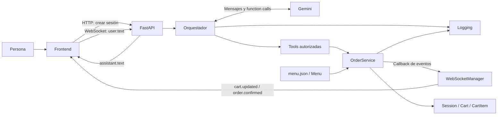
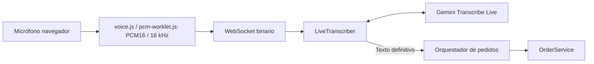

# Arquitectura y contratos actuales

Actualizada con [voz por turnos](voz.md) el 14/09/2026.

La captura y la conexión Live se preparan en paralelo. El frontend no habilita
el envío hasta recibir `voice.ready` y completar la preparación local, evitando
perder las primeras palabras por empezar a hablar durante el handshake.

## Visión general

Es una aplicación Python modular con FastAPI, un frontend de HTML/CSS/JavaScript
y Gemini como intérprete conversacional. No son microservicios: los módulos del
backend comparten un proceso y las sesiones viven en memoria.



El texto del asistente y el carrito tienen orígenes diferentes: Gemini redacta
el primero; el servicio construye el segundo. Una respuesta verbal nunca es, por
sí sola, evidencia de que un pedido se haya modificado.

## Mapa de módulos y funciones

| Archivo | Responsabilidad y puntos de entrada |
| --- | --- |
| `backend/domain/product.py` | `Product`, `ModifierGroup`, `ModifierOption`: estructura del catálogo y adicionales de precio. |
| `backend/domain/menu.py` | `load_menu()` convierte JSON a objetos; `Menu.get_product()` busca por identificador. |
| `backend/domain/cart_item.py` | `CartItem`: una línea con producto, cantidad, configuración y precio unitario. |
| `backend/domain/cart.py` | `Cart.total`: suma precio unitario por cantidad de cada línea. |
| `backend/domain/session.py` | `Session`: UUID, carrito independiente y estado `ACTIVE` o `CONFIRMED`. |
| `backend/services/order_service.py` | Validación y mutación mediante `add_item`, `remove_item`, `change_quantity`, `change_modifier`, `replace_item`, `clear_cart`, `confirm_order`; consulta mediante `get_cart`. |
| `backend/ai/tools.py` | Fábricas `create_*_tool`: crean funciones ligadas al servicio de una sesión y convierten resultados a diccionarios para Gemini. |
| `backend/ai/orchestrator.py` | `OrderConversationOrchestrator`: instrucciones, catálogo, historial conversacional del chat, control y ejecución manual de tools. |
| `backend/ai/gemini_client.py` | `create_gemini_client()`: construye el cliente autenticado del SDK. |
| `backend/ai/errors.py` | `AIProviderError` y clasificadores de errores HTTP/transporte; conservan etapa y si el pedido ya cambió. |
| `backend/api/app.py` | Sirve frontend, crea `SessionRuntime`, expone HTTP y WebSocket, serializa estado y traduce errores. Es el punto de ensamblado. |
| `backend/api/websocket_manager.py` | Registra una conexión por sesión y publica eventos, incluso desde código en otro thread. |
| `backend/logging/event_logger.py` | `log_event()`, formatters y handlers: JSONL detallado, texto legible y consola, con rotación. |
| `config/settings.py` | `get_gemini_api_key()`: carga `.env` y obtiene la clave del entorno. |
| `config/menu.json` | Catálogo local cargado al importar la API; editarlo requiere recargar el proceso. |
| `frontend/index.html` | Panel conversacional, formulario, controles de micrófono/voz y carrito. |
| `frontend/app.js` | `createSession`, `connectWebSocket`, `sendMessage`, `renderCart`; captura y conversión de audio, estados visuales. |
| `frontend/styles.css` | Distribución de paneles, mensajes, carrito y adaptación a pantallas pequeñas. |
| `backend/ai/test_chat.py` | Chat manual de terminal usando el mismo orquestador y servicio. |
| `backend/ai/test_live.py` | Experimento Live: envía texto y muestra transcripción de salida. |
| `backend/ai/test_live_audio.py` | Experimento Live: envía `sample.pcm` y muestra transcripciones de entrada/salida. |

El dominio no importa Gemini, FastAPI ni el frontend. El servicio sí depende del
logger y de un callback opcional; la separación es útil pero no constituye una
arquitectura hexagonal completa con todos sus puertos formalizados.

## Recorrido de un pedido escrito

1. Al cargar la página, `createSession()` llama a `POST /api/sessions`.
2. La API crea `Session`, `OrderService` y `OrderConversationOrchestrator` y los
   guarda en `sessions[session_id]`. Cada orquestador tiene su propio chat.
3. El navegador conecta `/ws/sessions/{session_id}` y envía `user.text`.
4. La API ejecuta `assistant.send_message()` mediante `asyncio.to_thread()` para
   no ejecutar la llamada síncrona a Gemini en el event loop del WebSocket.
5. Gemini recibe reglas y catálogo. Puede responder directamente o pedir una tool.
6. El orquestador verifica el nombre, ejecuta la función autorizada y devuelve
   su resultado a Gemini. `ValueError` de validación se convierte en un resultado
   estructurado que permite al modelo explicar el problema.
7. Una mutación válida llama a `_log_cart_updated()` y a `_emit_event()`.
   El callback programa la publicación del snapshot por WebSocket.
8. `renderCart()` actualiza productos e importe a partir de ese snapshot. La
   respuesta completa de Gemini llega aparte como `assistant.text`.

El cambio de carrito puede llegar antes de la respuesta textual final. No hay
streaming de tokens de respuesta ni procesamiento parcial de pedidos hablados.

## Tools y reglas

Las seis tools expuestas son `add_item`, `get_cart`, `change_modifier`,
`replace_item`, `remove_item` y `confirm_order`. `change_quantity` y `clear_cart`
existen en el servicio pero no tienen una tool expuesta: no debe anunciarse que
el bot las ejecuta directamente por conversación.

`add_item` devuelve `needs_clarification` si no recibe `size` o `drink`, sin
modificar nada. Después el servicio verifica producto, disponibilidad, cantidad
positiva, opciones y grupos obligatorios. La tool tiene esos dos grupos fijados
en código; el dominio representa grupos más generales.

Los datos pendientes se conservan en el contexto conversacional del modelo;
no existe una entidad `PendingOrder`. La regla de que el usuario haya indicado
realmente cada opción depende de la interpretación y del prompt: el servicio
comprueba validez, pero no puede probar el origen de un valor enviado por el LLM.

El orquestador desactiva la ejecución automática de funciones del SDK. Admite
varias function calls distintas por respuesta y las ejecuta en el orden recibido,
hasta cinco ciclos de tools por mensaje. Rechaza una misma combinación de nombre
y argumentos repetida dentro del turno. Esto también puede rechazar consultas
repetidas legítimas; no es una garantía general contra duplicados entre mensajes
o reconexiones.

## Modelo de datos y precios

El menú contiene Combo Big Mac (ARS 10.500 base) y Combo Cuarto de Libra (ARS 11.500
base). Ambos requieren `size` (internamente `MEDIUM` o `LARGE`, que se muestran como
Mediano o Grande; este último suma ARS 2.000) y
`drink` (`COCA` o `SPRITE`, sin adicional). Ambos figuran disponibles.

```text
precio unitario = precio base + suma de adicionales elegidos
total de línea = precio unitario × cantidad
total del carrito = suma de totales de línea
```

Hoy los enteros representan pesos argentinos completos, según catálogo y renderizado.
No hay convención de centavos ni soporte explícito de múltiples monedas.
Una línea puede tener varias unidades solo si comparten configuración; dos
combos con bebidas diferentes deben representarse en líneas distintas.

`line_id` usa `max(ids presentes) + 1`, por lo que puede reutilizar valores al
eliminar líneas. `replace_item` conserva ID y cantidad, valida el destino y
recién después modifica producto, opciones y precio.

`confirm_order()` rechaza carrito vacío y cambia el estado a `CONFIRMED`.
Después las mutaciones están bloqueadas. Esa confirmación es local, sin pago
ni aceptación de un sistema externo.

## Contratos de transporte

| Canal | Entrada / respuesta |
| --- | --- |
| `GET /` y `/static/*` | HTML y recursos del frontend. |
| `GET /api/health` | Estado del proceso; no verifica Gemini. |
| `POST /api/sessions` | Devuelve `session_id`, `state`, `cart`. |
| `GET /api/sessions/{id}/cart` | Snapshot `{items, total, state}`. |
| `POST /api/sessions/{id}/messages` | Recibe `{message}`; devuelve texto, carrito, estado de cierre o error estructurado. El frontend actual usa WebSocket para el chat. |
| `/ws/sessions/{id}` | Recibe JSON de texto y bytes de audio; publica los eventos siguientes. |

Ejemplo de entrada WebSocket:

```json
{"type":"user.text","data":{"message":"Quiero un Big Mac grande con Coca"}}
```

| Evento de salida | Contenido principal de `data` |
| --- | --- |
| `connection.ready` | `session_id`, `state`, `cart` para sincronizar al conectar. |
| `assistant.text` | `text`, `session_closed`, `cart`. |
| `cart.updated` | `action`, `line_id`, `cart`. |
| `order.confirmed` | `cart` con estado confirmado. |
| `voice.ready`, `voice.transcript`, `voice.error`, `voice.cancelled` | Protocolo de voz detallado en `voz.md`; reemplaza el acuse experimental `audio.received`. |
| `ai.error` | Tipo, código, etapa, `retryable`, `transaction_applied`, última tool y mensaje. |
| `client.error`, `backend.error` | Mensaje y, según el caso, tipo/origen. |

El callback de eventos evita importar WebSocket desde el servicio.
`send_event_threadsafe()` usa `asyncio.run_coroutine_threadsafe()`. El envío es
asíncrono y no se espera su resultado; no hay entrega garantizada ni replay.

## Audio integrado



La API delega el WebSocket en `conversation_socket.py`. La sesión reserva un turno
con `turn_lock`; la transcripción final sigue el mismo historial y tools que el
texto escrito. Los scripts Live anteriores siguen siendo experimentos separados.
El frontend lee la respuesta final con `speechSynthesis`; `toggleAssistantAudio()`
permite apagar y cancelar esa lectura. Detalles, límites y pruebas en [voz](voz.md).

## Observabilidad y errores

`events.jsonl` conserva eventos desde DEBUG, incluyendo texto, argumentos,
snapshots y errores. `runtime.log` y la consola muestran una selección más
compacta desde INFO. Los archivos rotan a 5 MB con tres respaldos por destino.
Los logs no son almacenamiento transaccional ni permiten restaurar sesiones.

`AIProviderError.transaction_applied` informa si alguna tool ya modificó el
pedido antes de una falla del proveedor. No revierte cambios ni indica que
todo un pedido de varias operaciones se haya completado. El HTTP devuelve
además el carrito actual; el WebSocket también incluye snapshot en la respuesta
final y los errores de interpretación, además de publicar eventos de estado.
