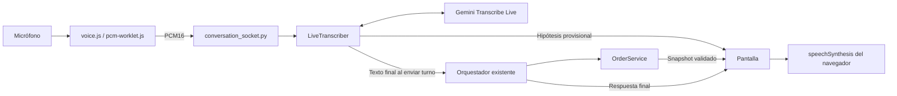

# Voz por turnos

Implementación inicial: 14/09/2026. Texto y voz comparten conversación y carrito.

## Recorrido y responsabilidades



`frontend/voice.js` gestiona permiso, inicio/cierre de micrófono y lectura.
`pcm-worklet.js` captura audio fuera del hilo principal, empaqueta bloques PCM16
little-endian mono a 16 kHz de 100 ms y vacía el último bloque antes de cerrar.
El contexto solicita 16 kHz y comprueba la frecuencia. No reproduce el micrófono
por los parlantes. Al hablar se cancela la lectura del asistente.

`backend/ai/live_transcriber.py` no tiene tools ni acceso al carrito. Publica
hipótesis, acumula segmentos definitivos y devuelve texto al cerrar el turno.
`backend/api/conversation_socket.py` valida eventos y entrega ese texto al mismo
orquestador del chat. Las reglas del servicio se conservan.

`SessionRuntime.turn_lock` reserva un turno entre voz, texto WebSocket y mensajes
HTTP; una segunda entrada simultánea se rechaza. `WebSocketManager` serializa
envíos, rechaza una segunda conexión por sesión (4409) y permite recuperar el
snapshot real en `connection.ready`. El navegador todavía no reconecta solo.

La pantalla muestra transcripción provisional debajo del chat. No se agregan
productos durante una frase: solo el texto definitivo enviado llega al orquestador.
El estado visual recorre conexión, preparación, escucha y procesamiento. El texto
vuelve a habilitarse al terminar, salvo si el pedido quedó confirmado.

## Contrato de eventos

| Evento | Dirección y significado |
| --- | --- |
| `audio.start` | Navegador → backend: reserva turno y abre Live. |
| `voice.ready` | Backend → navegador: puede empezar a enviar audio. |
| Frames binarios | Navegador → backend: PCM16 mono a 16 kHz. |
| `voice.transcript` | Backend → navegador: `{text, final}`; una hipótesis solo se muestra. |
| `audio.stop` | Navegador → backend: finaliza; repetirlo no ejecuta nuevamente el pedido. |
| `audio.cancel` | Navegador → backend: descarta transcripción que aún no llegó al orquestador. |
| `voice.cancelled` | Backend → navegador: cancelación atendida. |
| `voice.error` | Backend → navegador: falla de transcripción; el audio no ejecutó un pedido. Para fallas de Gemini incluye tipo, código, etapa y si se puede reintentar. |

Se conservan eventos escritos, carrito, confirmación y errores de IA.
`assistant.text` y errores de interpretación incluyen snapshot del carrito.
`audio.received` era experimental y deja de utilizarse.

El backend envía `activity_start` y `activity_end` al proveedor. Acepta cierre
mediante `turn_complete`, `generation_complete` o `input_transcription.finished`
después de terminar la entrada. La prueba real observó `generation_complete`
después del texto definitivo. Una hipótesis nunca sustituye un final faltante.

## Límites y recuperación

El frontend termina la captura a los 55 segundos. El backend admite hasta 60
segundos de audio, fragmentos de 32.768 bytes y cola de 128 fragmentos. Limita el
transcriptor a 85 segundos y espera el cierre hasta 20 segundos. La interfaz
también limita el tiempo de preparación. Una cola saturada produce un error;
no se descartan fragmentos silenciosamente.

Cancelar o desconectar descarta transcripciones pendientes y libera recursos.
Si ya comenzó la interpretación, se espera su resultado: cancelar una coroutine
no detiene el thread ni revierte una tool. La reserva se libera al terminar,
incluyendo cancelaciones previas al inicio de la tarea. No hay reintentos de
mutaciones automáticos. Los fallos después de una tool conservan el indicador
`transaction_applied` y el carrito actual.

La captura se libera al enviar, confirmar, fallar o salir de página. La lectura
usa voces del navegador/sistema: prefiere es-AR y luego otra voz española.
Su timbre y disponibilidad varían; no se garantiza ejecución local. Voz OFF
cancela la lectura, manteniendo el texto disponible.

## Configuración y decisión

`GEMINI_TRANSCRIPTION_MODEL` usa `gemini-3.5-transcribe-live` en la
configuración recomendada. El chat usa `GEMINI_CHAT_MODEL`, recomendado como
`gemini-3.7-flash` para la cuenta consultada el 15/09/2026. Ambos se pueden
cambiar en `.env` sin modificar el código. Las credenciales quedan en backend.
Para consultar los modelos habilitados para la cuenta local, ejecutar
`python -m backend.ai.list_models` con el entorno virtual activo. La salida es
informativa y muestra todos los modelos junto con sus acciones: `generateContent`
para el chat y `bidiGenerateContent` para transcripción en vivo. La disponibilidad
y los nombres pueden cambiar por cuenta o fecha, por lo que no son valores fijos.
Si el modelo configurado no existe o no admite Live, el error visible nombra el
modelo y recomienda este comando; el detalle original queda únicamente en los
logs locales. Los scripts Live anteriores se conservan como experimentos
independientes.

Un modelo con `bidiGenerateContent` requiere además comprobar que entregue la
transcripción de entrada usada por este adaptador. En la prueba del 15/09/2026,
`gemini-3.5-live-translate-preview` abrió la conexión pero agotó la espera sin
texto final; no debe sustituir a `gemini-3.5-transcribe-live` sin otra prueba.

Se eligió transcribir y reutilizar el orquestador para mantener un solo historial
de pedidos para ambos canales. Un agente Live con tools es una alternativa futura,
pero requiere adaptar conversación, interrupciones y ejecución de operaciones.
La primera versión usa clic para hablar y clic para enviar; aún faltan silencios
automáticos, interrupciones durante generación y evaluación de latencias/costos.

Fuentes: [transcripción y turnos de Gemini](https://ai.google.dev/gemini-api/docs/live-api/live-transcribe)
y [síntesis del navegador](https://developer.mozilla.org/en-US/docs/Web/API/SpeechSynthesis).

## Prueba manual desde VS Code

En PowerShell, desde la raíz:

```powershell
.\.venv\Scripts\Activate.ps1
python -m uvicorn backend.api.app:app --reload
```

Abrir `http://127.0.0.1:8000/` y recargar con `Ctrl+F5`. La captura requiere permiso
y localhost o HTTPS. Si falla activar el entorno, consultar [seguimiento](seguimiento.md).

1. Tocar **Hablar**, permitir micrófono y esperar **Escuchando**.
2. Decir «Quiero una Burger Clásica» y tocar **Enviar audio**. Debe preguntar la bebida;
   mostrar la hipótesis no debe agregar una línea.
3. Hablar otra vez: «Con Coca y queso», y enviar. Debe aparecer una unidad por ARS 9.500.
4. Pedir una pizza: debe informar que no está disponible, sin agregarla.
5. Apagar **Voz ON** y continuar escribiendo en la misma sesión.
6. Confirmar el pedido. Deben bloquearse micrófono y escritura.

Mientras aparece «Preparando micrófono y conexión...» el botón queda bloqueado:
ese estado evita hablar antes de que la captura esté conectada. Solo hay que
comenzar cuando aparezca «Escuchando». La preparación del micrófono y de Gemini
se inicia en paralelo para no sumar sus esperas.

Estas pruebas manuales consumen cuota. El timbre, ruido y tu micrófono físico
deben evaluarse en tu equipo: las pruebas automáticas no sustituyen esa evaluación.

## Pruebas automatizadas

```powershell
.\.venv\Scripts\Activate.ps1
python -m pip install -r requirements-dev.txt
python -m unittest discover -s tests -v
python -m unittest discover -s tests -p browser_voice.py -v
```

La prueba de navegador requiere Edge instalado. Usa servidor temporal, micrófono
sintético, transcriptor/orquestador simulados y servicio real. Comprueba el worklet,
la vista provisional, alta, total, confirmación y solicitud de síntesis. No escucha
parlantes ni llama a Gemini. La suite local cubre reglas del pedido, cancelación,
límites, desconexión, exclusión de turnos y marcadores de cierre del SDK.
