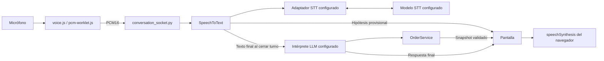

# Voz por turnos

Implementación inicial: 14/09/2026. Texto y voz comparten conversación y carrito.

## Recorrido y responsabilidades



`frontend/voice.js` gestiona permiso, inicio/cierre de micrófono, detección de
fin de habla y lectura. Calcula la energía RMS de cada bloque PCM: espera al
menos 200 ms de voz y luego finaliza cuando acumula 1,4 segundos de silencio.
El silencio previo a empezar a hablar no cierra el turno. **Enviar audio** se
mantiene como alternativa manual.
`pcm-worklet.js` captura audio fuera del hilo principal, empaqueta bloques PCM16
little-endian mono a 16 kHz de 100 ms y vacía el último bloque antes de cerrar.
El contexto solicita 16 kHz y comprueba la frecuencia. No reproduce el micrófono
por los parlantes. Al hablar se cancela la lectura del asistente.

`backend/ai/contracts.py` define `SpeechToText`; los adaptadores actuales
`GeminiLiveTranscriber` en `backend/ai/gemini_transcriber.py` y
`VoskTranscriber` en `backend/ai/vosk_transcriber.py` no tienen tools ni acceso
al carrito. Publican hipótesis y devuelven texto al cerrar el turno.
Vosk procesa localmente y evita la latencia de red, pero el modelo pequeño de
español no garantiza reconocimiento rioplatense: se observaron confusiones de
vocabulario como «esprit», «esperáis» o «espiral» por «Sprite». El adaptador
corrige esas variantes puntuales, «debida» por «bebida» y «concurre» o «q erre» por
«QR» antes de mostrar o interpretar el texto. Esta normalización no decide
productos ni modifica el carrito; una prueba real con micrófono debe evaluar si el
modelo sigue siendo aceptable para la demo.
`backend/api/conversation_socket.py` valida eventos y entrega ese texto al
`OrderInterpreter` elegido por `LLM_PROVIDER`. Las reglas del servicio se conservan.

`SessionRuntime.turn_lock` reserva un turno entre voz, texto WebSocket y mensajes
HTTP; una segunda entrada simultánea se rechaza. `WebSocketManager` serializa
envíos, rechaza una segunda conexión por sesión (4409) y permite recuperar el
snapshot real en `connection.ready` y reintenta la conexión con espera progresiva
si el canal se interrumpe.

La pantalla muestra transcripción provisional debajo del chat. No se agregan
productos durante una frase: solo el texto definitivo enviado llega al intérprete LLM.
El estado visual recorre conexión, preparación, escucha y procesamiento. El texto
vuelve a habilitarse al terminar, salvo si el pedido quedó confirmado.

## Contrato de eventos

| Evento | Dirección y significado |
| --- | --- |
| `audio.start` | Navegador → backend: reserva turno y abre Live. |
| `voice.ready` | Backend → navegador: puede empezar a enviar audio. |
| Frames binarios | Navegador → backend: PCM16 mono a 16 kHz. |
| `voice.transcript` | Backend → navegador: `{text, final}`; una hipótesis solo se muestra. |
| `audio.stop` | Navegador → backend: finaliza; repetirlo no ejecuta nuevamente el pedido. |
| `audio.cancel` | Navegador → backend: descarta transcripción que aún no llegó al intérprete LLM. |
| `voice.cancelled` | Backend → navegador: cancelación atendida. |
| `voice.error` | Backend → navegador: falla de transcripción; el audio no ejecutó un pedido. Si el proveedor informa detalles, incluye tipo, código, etapa y si se puede reintentar. |
| `voice.retry_ready` | Backend → navegador: terminó de liberar un turno de STT fallido; se puede iniciar otro. |

Se conservan eventos escritos, carrito, confirmación y errores de IA.
`assistant.text` y errores de interpretación incluyen snapshot del carrito.
`audio.received` era experimental y deja de utilizarse.

El backend envía `activity_start` y `activity_end` al proveedor. Acepta cierre
mediante `turn_complete`, `generation_complete` o `input_transcription.finished`
después de terminar la entrada. La prueba real observó `generation_complete`
después del texto definitivo. Una hipótesis nunca sustituye un final faltante.
Si el proveedor no abre el turno se publica `voice.error` con etapa
`VOICE_CONNECTION`; si recibió el audio pero no confirma el texto final, la
etapa es `VOICE_FINALIZATION`. En los dos casos el backend cierra el adaptador,
libera la reserva de turno y conserva el carrito para que se pueda volver a
hablar o escribir.

## Límites y recuperación

El frontend termina la captura a los 55 segundos. El backend admite hasta 60
segundos de audio, fragmentos de 32.768 bytes y cola de 128 fragmentos. Limita el
transcriptor a 85 segundos y espera el cierre hasta 20 segundos. La interfaz
también limita el tiempo de preparación. Una cola saturada produce un error;
no se descartan fragmentos silenciosamente.

Cancelar, fallar o desconectar descarta transcripciones pendientes y libera recursos.
Si ya comenzó la interpretación, se espera su resultado: cancelar una coroutine
no detiene el thread ni revierte una tool. La reserva se libera al terminar,
incluyendo cancelaciones previas al inicio de la tarea. No hay reintentos de
mutaciones automáticos. Los fallos después de una tool conservan el indicador
`transaction_applied` y el carrito actual.

La captura se libera al enviar, confirmar, fallar o salir de página. La lectura
usa voces del navegador/sistema: prefiere es-AR y luego otra voz española.
Antes de sintetizar, el frontend convierte puntos de miles como `11.500` en
una separación que la voz suele pronunciar como once mil quinientos, y elimina
marcas Markdown que no aportan información audible.
Su timbre y disponibilidad varían; no se garantiza ejecución local. Voz OFF
cancela la lectura, manteniendo el texto disponible.

## Configuración y decisión

El `.env.example` usa `STT_PROVIDER=vosk`, que requiere el modelo local indicado
por `STT_MODEL_PATH` y no necesita API key para la transcripción. También se
puede elegir Gemini mediante `GEMINI_TRANSCRIPTION_MODEL=gemini-3.5-transcribe-live`.
La demo usa Groq para el chat mediante
`GROQ_CHAT_MODEL=openai/gpt-oss-20b`; también se puede elegir Gemini u OpenAI
con sus variables propias. Los nombres se pueden cambiar en `.env` sin modificar
el código y las credenciales quedan en backend. La descarga, verificación y
configuración del modelo Vosk están explicadas paso a paso en el
[README principal](../README.md#usar-vosk-como-stt-local).
Para consultar los modelos Gemini habilitados para la cuenta local, ejecutar
`python -m backend.ai.list_gemini_models` con el entorno virtual activo. La salida es
informativa y muestra todos los modelos junto con sus acciones: `generateContent`
para el chat y `bidiGenerateContent` para transcripción en vivo. La disponibilidad
y los nombres pueden cambiar por cuenta o fecha, por lo que no son valores fijos.
Si el modelo configurado no existe o no admite Live, el error visible nombra el
modelo y recomienda este comando; el detalle original queda únicamente en los
logs locales. Los experimentos Live anteriores que dejaron de aportar valor no
se conservan como scripts de uso del proyecto.

Un modelo con `bidiGenerateContent` requiere además comprobar que entregue la
transcripción de entrada usada por este adaptador. En la prueba del 15/09/2026,
`gemini-3.5-live-translate-preview` abrió la conexión pero agotó la espera sin
texto final; no debe sustituir a `gemini-3.5-transcribe-live` sin otra prueba.

Para este adaptador STT, un candidato necesita cuatro condiciones: aparecer
con `bidiGenerateContent` en la cuenta, estar documentado como **Live
Transcription**, aceptar `response_modalities=["TEXT"]` e
`input_audio_transcription`, y emitir `server_content.input_transcription` final
después de `activity_end`. El listado local solo demuestra la primera condición;
la documentación del proveedor y una prueba con audio real validan las restantes.
Google documenta explícitamente ese contrato para `gemini-3.5-transcribe-live`.

Se eligió transcribir y reutilizar el intérprete LLM para mantener un solo historial
de pedidos para ambos canales. Un agente Live con tools es una alternativa futura,
pero requiere adaptar conversación, interrupciones y ejecución de operaciones.
La captura comienza con un clic y termina automáticamente por silencio o con el
botón manual. Siguen fuera de esta demo las interrupciones mientras el asistente
genera una respuesta y la evaluación productiva de latencias y costos.

Fuentes: [transcripción y turnos de Gemini](https://ai.google.dev/gemini-api/docs/live-api/live-transcribe)
y [síntesis del navegador](https://developer.mozilla.org/en-US/docs/Web/API/SpeechSynthesis).

## Prueba manual desde VS Code

En PowerShell, desde la raíz:

```powershell
.\.venv\Scripts\Activate.ps1
python -m uvicorn backend.api.app:app --reload
```

Abrir `http://127.0.0.1:8000/` y recargar con `Ctrl+F5`. La captura requiere permiso
y localhost o HTTPS. Si PowerShell bloquea la activacion, usar la solucion temporal indicada en el README principal.

1. Tocar **Hablar**, permitir micrófono y esperar **Escuchando**.
2. Decir «Quiero una Burger Clásica» y guardar silencio. Debe enviar el audio
   automáticamente y preguntar la bebida; mostrar la hipótesis no debe agregar una línea.
3. Hablar otra vez: «Con Sprite y queso» y guardar silencio. Debe aparecer una unidad por
   ARS 9.500. Repetir una vez usando **Enviar audio** para comprobar el cierre manual.
4. Pedir una pizza: debe informar que no está disponible, sin agregarla.
5. Apagar **Voz ON** y continuar escribiendo en la misma sesión.
6. Confirmar el pedido. Deben bloquearse micrófono y escritura mientras se
   elige QR, tarjeta o caja; **Atrás** debe devolver el mismo carrito a edición.
7. Completar cada pago simulado. Debe mostrarse el número de pedido y luego
   comenzar automáticamente una sesión nueva.

Mientras aparece «Preparando micrófono y conexión...» el botón queda bloqueado:
ese estado evita hablar antes de que la captura esté conectada. Solo hay que
comenzar cuando aparezca «Escuchando». La preparación del micrófono y del
proveedor STT configurado se inicia en paralelo para no sumar sus esperas.

Estas pruebas manuales consumen cuota. El timbre, ruido y tu micrófono físico
deben evaluarse en tu equipo: las pruebas automáticas no sustituyen esa evaluación.

## Pruebas automatizadas

```powershell
.\.venv\Scripts\Activate.ps1
python -m pip install -r requirements-dev.txt
python -m unittest discover -s tests -v
python -m unittest discover -s tests -p browser_voice.py -v
```

La prueba de navegador requiere Edge instalado. Usa servidor temporal, un audio
sintético con voz y silencio, transcriptor/orquestador simulados y servicio real.
Comprueba el worklet, que el silencio previo no cierre, el cierre automático una
sola vez, la vista provisional, alta, total, confirmación y solicitud de síntesis. No escucha
parlantes ni llama a Gemini. La suite local cubre reglas del pedido, cancelación,
límites, desconexión, exclusión de turnos y marcadores de cierre del SDK.

## Reconexion del navegador

La perdida de WebSocket no reenvia un turno de voz ni un mensaje escrito. La
interfaz descarta el audio local, muestra que esta reconectando y usa el mismo
identificador de sesion. Al reconectar recibe `connection.ready` con el carrito
real y continua desde ese estado. Esto evita duplicar mutaciones si el backend
termino una operacion mientras el navegador estaba desconectado.

La reconexion usa espera progresiva hasta quince segundos entre intentos. Si la
sesion ya no existe en memoria, el backend cierra con 4404 y la interfaz comienza
un pedido nuevo. La recuperacion despues de reiniciar el proceso requiere una
base de datos y queda fuera de la demo actual.

Cuando llega la transcripción final, el frontend cambia el estado de «Procesando
audio» a «Audio transcripto. Procesando pedido». Así se distingue la espera del
STT de la interpretación y ejecución posterior del pedido, aunque ambas formen
parte del mismo turno para la persona.

Los importes se muestran como `$23.000 pesos argentinos`. Antes de invocar la
síntesis del navegador, `prepareSpeechText()` elimina el símbolo y los puntos de
miles y entrega `23000 pesos argentinos`. La separación entre texto visible y
texto hablado evita que ciertos motores pronuncien «veintitrés cero cero cero»
o interpreten el punto como decimal.

Los resúmenes del carrito usan guiones visibles y expresan una cantidad unitaria
como `Burger Clásica. Cantidad: una unidad`, sin un `1` que pueda confundirse con
el índice de una lista. El frontend conserva los saltos de línea y
`prepareSpeechText()` quita el guion inicial antes de leer. Los modificadores
opcionales se pronuncian agrupados, por ejemplo `Extras: Tomate, Lechuga`, sin
repetir el nombre técnico de cada grupo. La voz comunica solamente el total; los
precios por producto permanecen disponibles en el carrito visual.


## Adaptador de transcripción y selección de proveedor

Desde el 16/09/2026, `conversation_socket.py` depende de `SpeechToText`, no de
una clase Gemini. Al recibir `audio.start` pide el adaptador a
`create_speech_to_text()`. El contrato recibe PCM con `feed()`, anuncia el fin
con `finish()`, publica parciales y devuelve el texto definitivo con
`transcribe()`, y permite `cancel()` y `close()` al abandonar el turno o el
WebSocket.

Las implementaciones efectivas son `GeminiLiveTranscriber` en
`backend/ai/gemini_transcriber.py` y `VoskTranscriber` en
`backend/ai/vosk_transcriber.py`. `STT_PROVIDER` admite `gemini` o `vosk`.
Vosk carga el modelo local una vez, procesa PCM16 a 16 kHz, publica hipótesis
con `PartialResult()` y solo entrega `FinalResult()` después de `audio.stop`.
Configurar por ahora `whisper`, `openai`, `google-cloud` o `azure` devuelve un
error claro antes de abrir el turno.

Un futuro adaptador debe conservar el contrato completo: preparar su conexión,
aceptar fragmentos, publicar hipótesis separadas del final, no entregar texto
incompleto al pedido, cancelar sin mutar y cerrar sus recursos. Vosk ya usa el
modelo local definido en `STT_MODEL_PATH`; Whisper requeriría su propio modelo
local y los servicios cloud la credencial del proveedor seleccionado. La elección
se debe hacer con una matriz de prueba real de latencia, ruido, costo, hardware e
interrupciones; esta arquitectura permite esa comparación sin reescribir
`OrderService`.


OpenAI y Groq estan implementados solo como interpretes LLM.
`STT_PROVIDER=openai` o `STT_PROVIDER=groq` no son validos todavia: cada
transcripcion por streaming requerira otro adaptador que implemente el contrato
completo de voz. Groq ofrece actualmente un endpoint de transcripción por
archivo para Whisper, pero no es equivalente al canal de fragmentos Live usado
por esta demo; integrarlo requeriría acumular el audio hasta `audio.stop` y
perdería las hipótesis parciales mientras se habla.

Si la persona dice directamente «quiero pagar con QR», «tarjeta» o «en caja»,
la tool de selección prepara el estado `PAYMENT_PENDING` cuando todavía estaba
`ACTIVE` y registra el método en el mismo turno. Esto evita depender de dos
frases separadas (confirmar primero y elegir después).
